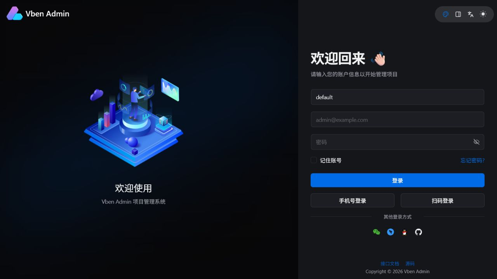
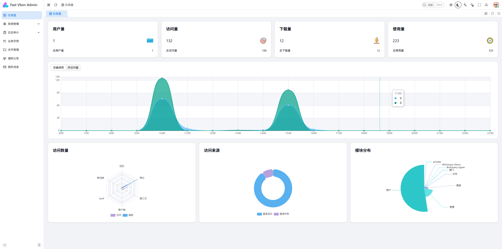
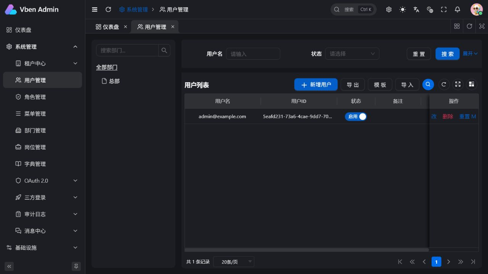
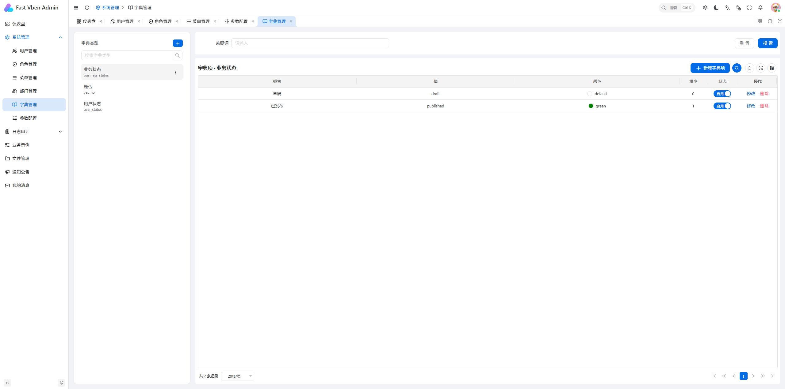
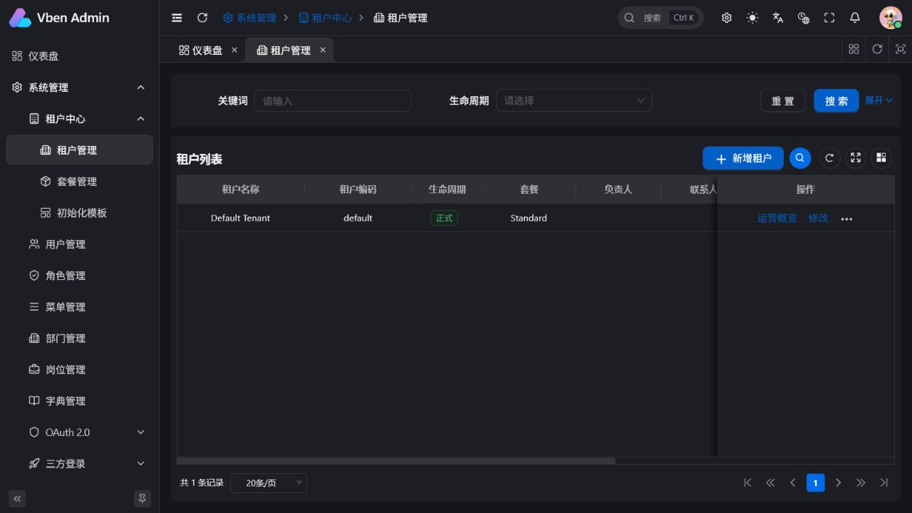
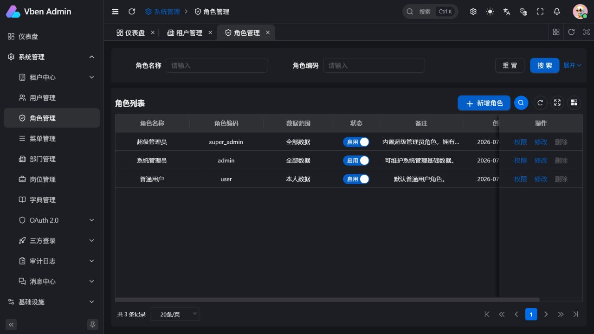
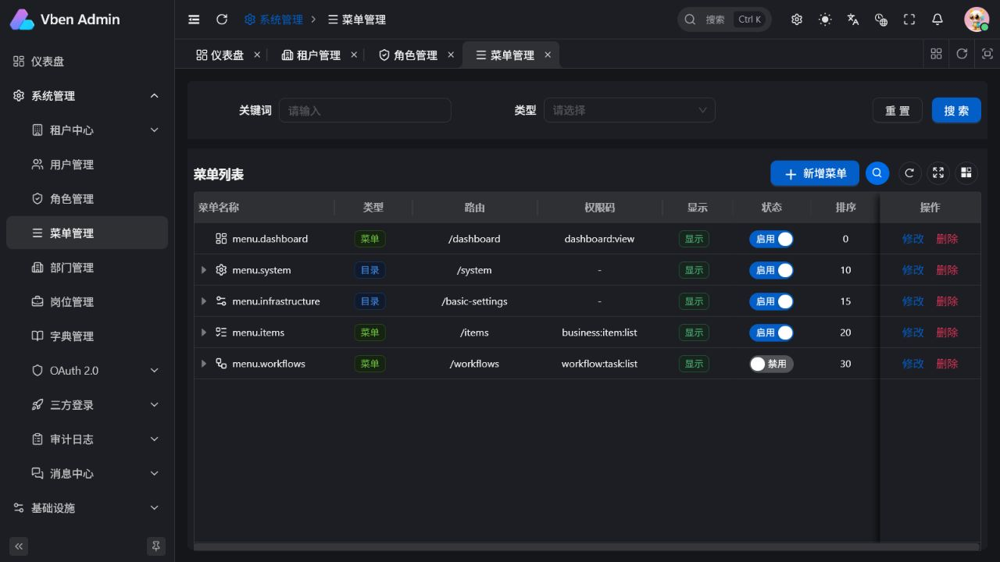
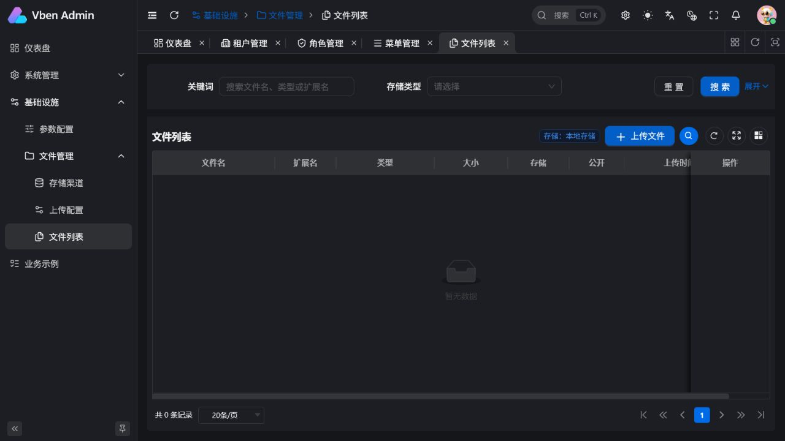
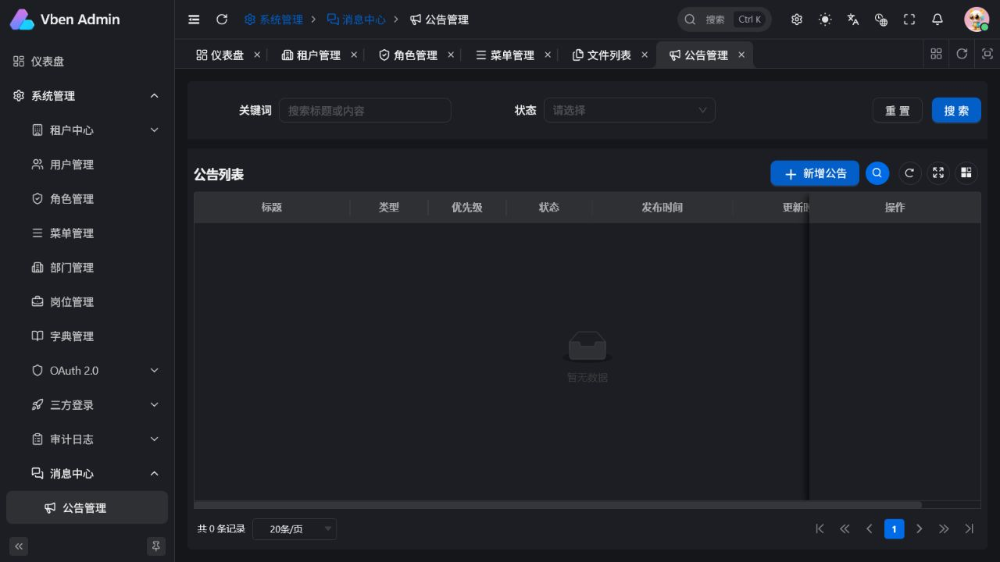

# Fast Vben Admin

**中文** | [English](./README.en-US.md)

Fast Vben Admin 是一个面向中后台业务的全栈管理平台基座。项目以 FastAPI 提供真实 API 和权限边界，以 Vue Vben Admin 的 `web-antd` 应用提供管理界面，并围绕多租户、RBAC、文件存储、审计和基础设施管理提供可扩展的实现。

## 在线演示

[http://114.132.74.2:5173/auth/login](http://114.132.74.2:5173/auth/login)

```text
租户编码：default
邮箱：admin@example.com
密码：changethis
```

## 开发须知

- 前端接口类型由后端 OpenAPI Schema 生成。修改 API 后请执行 `pnpm generate:api`，不要手动修改 `src/api/generated` 中的文件。
- Docker Compose 的默认覆盖配置用于本地热更新，前端地址为 `http://localhost:5174`；生产组合配置使用 `http://localhost:5173`。

## 平台简介

项目采用前后端分离架构：后端 API 统一挂载在 `/api/v1`，前端根据后端返回的菜单和权限码生成导航与按钮权限。内置 PostgreSQL、Redis、Mailpit、Adminer 及可选 MinIO 服务，可作为管理后台、SaaS 多租户系统或新业务模块的起点。

## 内置能力

### 系统与权限

| 模块 | 说明 |
| --- | --- |
| 登录与账户安全 | JWT 登录、密码找回与重置、登录限流和验证码、二维码登录、TOTP MFA 与恢复码、个人资料及密码管理。 |
| 企业身份接入 | 可配置企业 OIDC 单点登录、账户映射、角色映射和账号有效状态同步。 |
| RBAC | 用户、角色、菜单、权限码、后端权限校验和后端动态菜单。 |
| 组织管理 | 部门、岗位、用户岗位关联，以及角色级的全部、部门、部门及下级、本人和自定义部门数据权限。 |
| 多租户 | 共享表租户隔离、成员关系、租户切换与旧会话失效、租户套餐、配额和初始化模板。 |
| 审计与消息 | 登录日志、操作日志、公告发布、站内消息和已读状态管理。 |

### 基础设施与业务扩展

| 模块 | 说明 |
| --- | --- |
| 参数与字典 | 租户级系统参数、公开参数、字典类型和字典项管理。 |
| 文件服务 | 文件管理、头像上传、扩展名及大小限制、本地存储和 S3/MinIO 兼容对象存储、私有文件预签名下载。 |
| 通信配置 | 邮箱、短信渠道、模板和发送日志管理页。 |
| 代码生成 | 按数据库表结构生成 FastAPI Schema、CRUD 路由骨架、Vben API 封装及列表页的 ZIP 起始模块。 |
| OpenAPI 契约 | 从当前后端导出 Schema，生成前端 TypeScript 类型和客户端代码。 |
| 示例业务 | Items 模块提供 CRUD、导入、导出、CSV 模板和租户隔离的完整示例。 |
| 可观测性 | 健康检查、Prometheus Metrics、Sentry 接入点，以及后端、前端和 Compose CI 工作流。 |

## 技术栈

| 技术 | 用途 |
| --- | --- |
| Python 3.14、FastAPI、SQLModel、Alembic | 后端服务、数据模型和数据库迁移 |
| PostgreSQL 17、Redis 8 | 业务数据、缓存、登录限流和临时状态 |
| Vue 3、Vite、TypeScript、Pinia、Vue Router | 前端应用与状态、路由管理 |
| Vue Vben Admin、Ant Design Vue | `web-antd` 管理后台界面 |
| pnpm 11、uv | 前后端依赖与开发工具链 |
| Docker Compose、Nginx、Mailpit、Adminer、MinIO | 本地与容器化运行、邮件预览、数据库管理和对象存储 |

## 演示图

以下截图来自本项目本地 Compose 环境的默认租户。

### 基础概览

| 登录页 | 仪表盘 |
| --- | --- |
|  |  |

| 用户管理 | 字典管理 |
| --- | --- |
|  |  |

### 租户与权限

| 租户管理 | 角色管理 |
| --- | --- |
|  |  |

| 菜单管理 | 文件管理 |
| --- | --- |
|  |  |

### 消息中心

| 公告管理 |
| --- |
|  |

## 项目启动

### 环境要求

- Docker Desktop / Docker CLI（推荐的完整本地环境）
- Python 3.14、[uv](https://docs.astral.sh/uv/)（后端独立开发）
- Node.js 22.18+、pnpm 11.7+（前端独立开发）

### Docker Compose 本地开发

```powershell
Copy-Item .env.example .env
docker compose up --build
```

默认服务地址：

| 服务 | 地址 |
| --- | --- |
| 前端开发服务 | http://localhost:5174 |
| 后端 API | http://localhost:8000/api/v1 |
| API 文档 | http://localhost:8000/docs |
| OpenAPI Schema | http://localhost:8000/api/v1/openapi.json |
| 邮件预览 | http://localhost:1080 |
| Adminer | http://localhost:8080 |

默认管理员：

```text
租户编码：default
邮箱：admin@example.com
密码：changethis
```

仅可在本地环境使用上述默认凭据。部署到非本地环境前，必须修改 `SECRET_KEY`、`FIRST_SUPERUSER_PASSWORD`、`POSTGRES_PASSWORD`、CORS 白名单和存储服务凭据。

需要 MinIO 时，使用 storage profile 启动：

```powershell
docker compose --profile storage up --build
```

MinIO API 地址为 `http://localhost:9000`，控制台地址为 `http://localhost:9001`。

### 本地独立开发

Windows 环境可先执行初始化脚本创建 `.env` 并安装前后端依赖：

```powershell
pnpm setup
```

后端使用本机 PostgreSQL 时，先覆盖 Docker 内部数据库主机名：

```powershell
$env:POSTGRES_SERVER = 'localhost'
cd backend
uv sync
uv run alembic upgrade head
uv run python app/initial_data.py
uv run fastapi dev app/main.py
```

前端独立启动：

```powershell
cd frontend
pnpm install
pnpm -F @vben/web-antd run dev
```

### 常用命令

```powershell
pnpm backend:lint
pnpm backend:test
pnpm frontend:typecheck
pnpm frontend:build
pnpm frontend:e2e
pnpm generate:api
```

根目录的 `pnpm generate:api -- --edition suite` 会从当前后端组合导出临时 OpenAPI Schema，分别生成平台和模块客户端，无需预先启动 `localhost:8000`。

## 部署

生产环境使用基础 Compose 文件和生产覆盖文件构建，前端监听 `http://localhost:5173`：

```powershell
Copy-Item .env.example .env
docker compose -f compose.yml -f compose.production.yml up -d --build
```

生产配置、迁移策略、文件持久化和 S3/MinIO 配置见 [部署说明](./docs/deployment.md)。

## 文档

- [本地开发](./docs/development.md)
- [部署说明](./docs/deployment.md)
- [API 契约](./docs/api-contract.md)
- [RBAC 权限](./docs/rbac.md)
- [模块开发指南](./docs/module-guide.md)
- [模块化产品架构规划](./docs/modular-product-architecture.md)
- [架构决策记录](./docs/adr/README.md)
- [企业 OIDC 配置](./docs/enterprise-oidc.md)
- [监控说明](./docs/monitoring.md)
- [常见问题](./docs/faq.md)

## 支持项目

如果这个项目对你有所帮助，欢迎请我喝杯咖啡。你的支持会成为持续维护和改进项目的动力，感谢每一份鼓励。

<p align="center">
  
</p>

## 致谢

本项目基于并参考 [Full Stack FastAPI Template](https://github.com/fastapi/full-stack-fastapi-template) 和 [Vue Vben Admin](https://github.com/vbenjs/vue-vben-admin) 的架构与实践。
