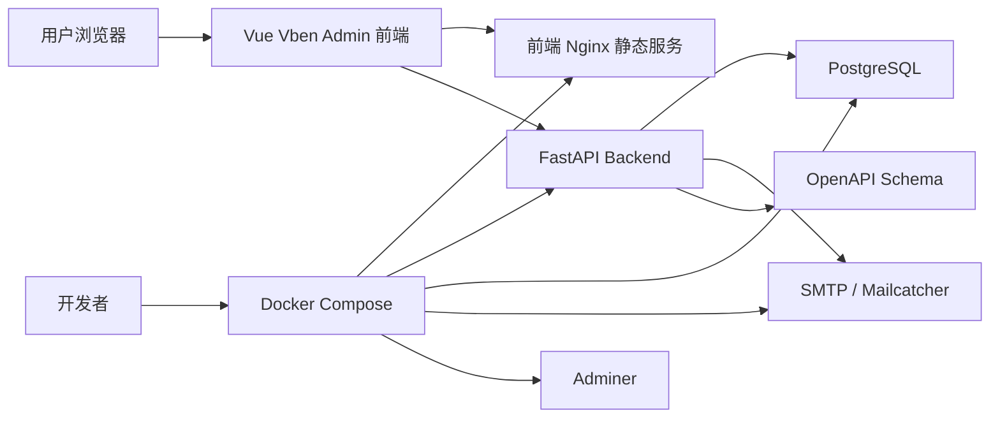
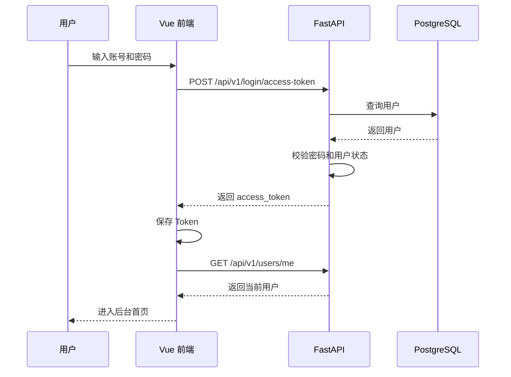
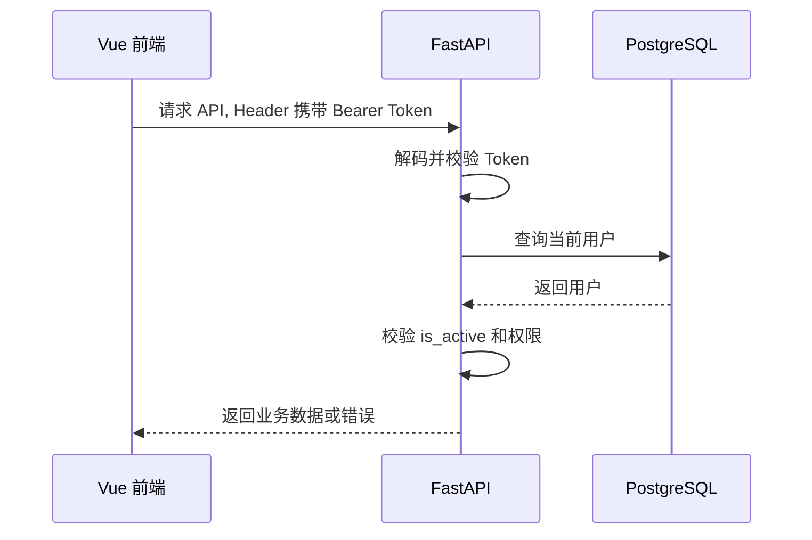

# Fast Vben Admin 技术需求文档 TRD

## 1. 文档信息

| 项目 | 内容 |
| --- | --- |
| 文档名称 | Fast Vben Admin 技术需求文档 |
| 文档类型 | TRD, Technical Requirements Document |
| 关联文档 | [PRD](./PRD.md), [DEVELOPMENT_PLAN](./DEVELOPMENT_PLAN.md) |
| 项目阶段 | MVP 技术设计 |
| 目标版本 | v1.0.0 |
| 更新日期 | 2026-07-07 |

## 2. 文档目标

本文档用于把 PRD 中的产品目标转化为可执行、可验证、可维护的技术要求。它约束项目的系统架构、技术栈、模块边界、数据模型、API 契约、权限模型、部署方式、测试策略和工程规范。

本文档回答以下问题：

- 系统整体如何分层。
- 后端、前端、数据库、容器分别承担什么职责。
- 前后端如何通过稳定 API 契约协作。
- 用户、认证、权限、示例业务模块如何落地。
- 本地开发和生产部署如何保持一致。
- 如何通过测试和 CI 保证模板质量。
- 如何为后续 RBAC、多租户、文件上传等功能预留扩展点。

## 3. 技术目标

### 3.1 MVP 技术目标

- 保留 `full-stack-fastapi-template` 的 FastAPI 后端工程能力。
- 保留 `vue-vben-admin` 的中后台前端体验和工程组织能力。
- 完成真实后端认证，不使用前端 Mock 登录作为默认行为。
- 使用 PostgreSQL 作为默认数据库。
- 使用 SQLModel 和 Alembic 管理数据模型与迁移。
- 使用 JWT 作为 MVP 默认认证机制。
- MVP 仅支持邮箱和密码登录，不实现 refresh token；Token 续期作为后续增强。
- 使用 Docker Compose 提供统一本地启动和生产部署路径。
- 使用 OpenAPI 作为前后端类型契约来源。
- 提供最小可用的用户管理、权限控制、示例业务 CRUD。
- 提供可重复执行的测试、构建、Lint、CI 流程。

### 3.2 非目标

MVP 阶段不实现以下能力：

- 完整 RBAC 表结构和权限管理 UI。
- 多租户隔离。
- OAuth2 / OIDC 第三方登录。
- 文件上传和对象存储。
- WebSocket 实时通知。
- 多数据库适配。
- Kubernetes Helm Chart。
- 服务端渲染。
- 低代码页面设计器。

以上能力需预留技术扩展点，但不能阻塞 MVP。

## 4. 总体架构

### 4.1 架构概览



### 4.2 运行时组件

| 组件 | 技术 | 职责 |
| --- | --- | --- |
| Frontend | Vue 3, Vite, TypeScript, Vben | 管理后台 UI、路由、菜单、状态、请求封装 |
| Backend | FastAPI, SQLModel, Pydantic | API、认证、权限、业务逻辑、数据访问 |
| Database | PostgreSQL | 持久化用户、业务数据、迁移状态 |
| Migration | Alembic | 数据库 schema 版本管理 |
| Mail | Mailcatcher / SMTP | 本地邮件预览和生产邮件发送 |
| Static Server | Nginx | 生产环境托管前端静态资源 |
| Reverse Proxy | Traefik / Nginx | 可选，生产域名、HTTPS、服务转发 |
| Adminer | Adminer | 本地数据库管理 |
| CI | GitHub Actions | 自动测试、构建、质量检查 |

### 4.3 数据流

#### 4.3.1 登录数据流



#### 4.3.2 受保护接口访问流



## 5. 仓库结构

### 5.1 目标结构

```text
fast-vben-admin/
  backend/
    app/
      api/
        deps.py
        main.py
        routes/
          login.py
          users.py
          items.py
          utils.py
      core/
        config.py
        db.py
        security.py
      alembic/
      email-templates/
      crud.py
      initial_data.py
      main.py
      models.py
      utils.py
    scripts/
    tests/
    alembic.ini
    pyproject.toml
    Dockerfile
  frontend/
    apps/
      web-antd/
        src/
          api/
          router/
          store/
          views/
          layouts/
          bootstrap.ts
          app.vue
    packages/
    package.json
    pnpm-workspace.yaml
    Dockerfile
    nginx.conf
  docs/
    PRD.md
    DEVELOPMENT_PLAN.md
    TRD.md
    development.md
    deployment.md
    api-contract.md
  scripts/
    init.ps1
    init.sh
    dev.ps1
    dev.sh
  compose.yml
  compose.override.yml
  .env.example
  README.md
  CONTRIBUTING.md
  CHANGELOG.md
  LICENSE
```

### 5.2 结构约束

- `backend` 只包含后端运行、测试、迁移、邮件模板相关内容。
- `frontend` 只包含前端工程、UI 组件、前端构建和 Nginx 配置。
- 根目录只放跨端配置、统一脚本、文档和 Compose。
- `docs` 存放用户和开发者可读文档。
- 生成代码需要放入明确目录，例如 `frontend/apps/web-antd/src/api/generated`。
- 不允许把真实 `.env`、密钥、数据库数据、构建产物提交到仓库。

## 6. 后端技术需求

### 6.1 后端分层

后端采用 FastAPI 常规分层：

| 层 | 目录 / 文件 | 职责 |
| --- | --- | --- |
| App Entry | `app/main.py` | 创建 FastAPI 实例，注册路由、中间件、异常处理 |
| API Router | `app/api/routes/*` | 定义 HTTP 路由、请求响应模型、依赖注入 |
| API Main | `app/api/main.py` | 聚合模块路由 |
| Dependencies | `app/api/deps.py` | 当前用户、权限、数据库 Session 等依赖 |
| Core Config | `app/core/config.py` | 环境变量、应用配置 |
| Core Security | `app/core/security.py` | 密码哈希、JWT、Token 生成与解析 |
| Core DB | `app/core/db.py` | 数据库连接和 Session |
| Models | `app/models.py` | SQLModel 表模型和 Pydantic Schema |
| CRUD | `app/crud.py` | 数据访问和业务持久化逻辑 |
| Initial Data | `app/initial_data.py` | 初始化超级管理员和基础数据 |
| Utils | `app/utils.py` | 邮件、Token、辅助函数 |
| Tests | `tests/` | API、CRUD、脚本测试 |

### 6.2 FastAPI 应用要求

- API 统一挂载在 `/api/v1`。
- OpenAPI 文档默认开发环境可访问。
- 生产环境是否开放 `/docs` 由环境变量控制。
- 所有路由必须声明明确的请求模型和响应模型。
- 受保护接口必须通过依赖注入获取当前用户。
- 管理接口必须显式校验超级管理员权限。
- 错误响应格式必须稳定，避免前端逐接口适配。

### 6.3 后端配置项

`.env.example` 至少包含：

```env
PROJECT_NAME=Fast Vben Admin
STACK_NAME=fast-vben-admin
ENVIRONMENT=local
DOMAIN=localhost
FRONTEND_HOST=http://localhost:5173
BACKEND_CORS_ORIGINS=["http://localhost:5173","http://localhost"]

SECRET_KEY=changethis
ACCESS_TOKEN_EXPIRE_MINUTES=11520

FIRST_SUPERUSER=admin@example.com
FIRST_SUPERUSER_PASSWORD=changethis

POSTGRES_SERVER=db
POSTGRES_PORT=5432
POSTGRES_DB=app
POSTGRES_USER=postgres
POSTGRES_PASSWORD=changethis

SMTP_HOST=
SMTP_PORT=587
SMTP_TLS=true
SMTP_SSL=false
SMTP_USER=
SMTP_PASSWORD=
EMAILS_FROM_EMAIL=info@example.com

SENTRY_DSN=
```

### 6.4 配置校验要求

- 生产环境启动时，如果 `SECRET_KEY`、`FIRST_SUPERUSER_PASSWORD`、`POSTGRES_PASSWORD` 仍为 `changethis`，应给出明确警告或拒绝启动。
- CORS 来源必须从环境变量读取。
- 数据库连接信息必须支持容器网络和本地调试两种场景。
- SMTP 未配置时，密码找回接口不应导致服务崩溃，应返回可诊断错误或在本地使用 Mailcatcher。

## 7. 数据模型设计

### 7.1 基础字段规范

MVP 对外核心表必须包含：

- `id`: 主键，优先使用 UUID。
- `created_at`: 创建时间。
- `updated_at`: 更新时间。

MVP 可沿用参考项目已有 ID 策略，但文档、数据库模型、响应模型和前端类型必须保持一致。`updated_at` 必须由后端统一维护，创建时等于 `created_at`，更新数据时自动刷新。

### 7.2 User 模型

#### 7.2.1 字段

| 字段 | 类型 | 必填 | 说明 |
| --- | --- | --- | --- |
| id | UUID | 是 | 用户唯一标识 |
| email | string | 是 | 登录邮箱，唯一 |
| hashed_password | string | 是 | 哈希后的密码 |
| full_name | string | 否 | 用户姓名 |
| is_active | boolean | 是 | 是否启用 |
| is_superuser | boolean | 是 | 是否超级管理员 |
| created_at | datetime | 是 | 创建时间 |
| updated_at | datetime | 是 | 更新时间 |

#### 7.2.2 约束

- `email` 必须唯一。
- `email` 必须符合邮箱格式。
- 禁用用户不能登录。
- 删除用户时需校验不能删除最后一个超级管理员。
- 修改用户 `is_superuser` 时需校验不能导致系统没有任何超级管理员。
- 普通用户不能修改自己的 `is_superuser`。
- 普通用户不能通过 API 越权修改其他用户。

### 7.3 Item 模型

#### 7.3.1 字段

| 字段 | 类型 | 必填 | 说明 |
| --- | --- | --- | --- |
| id | UUID | 是 | 示例资源唯一标识 |
| title | string | 是 | 标题 |
| description | string | 否 | 描述 |
| owner_id | UUID | 是 | 所属用户 |
| created_at | datetime | 是 | 创建时间 |
| updated_at | datetime | 是 | 更新时间 |

#### 7.3.2 约束

- 普通用户只能查看和操作自己的 Item。
- 超级管理员可以查看和操作全部 Item。
- 创建 Item 时 `owner_id` 默认绑定当前用户。
- 删除用户时，用户拥有的 Item 应按业务规则处理。MVP 推荐级联删除或限制删除，具体策略必须在模型和测试中保持一致。

### 7.4 后续扩展模型

MVP 不实现，但需要预留命名和扩展方向：

| 模型 | 说明 |
| --- | --- |
| Role | 角色 |
| Permission | 权限码 |
| Menu | 动态菜单 |
| UserRole | 用户角色关联 |
| RolePermission | 角色权限关联 |
| AuditLog | 操作审计 |
| SystemConfig | 系统配置 |
| FileAsset | 文件资源 |

## 8. 数据库与迁移

### 8.1 数据库要求

- 默认数据库为 PostgreSQL。
- 本地开发通过 Docker Compose 启动。
- 生产环境通过环境变量配置连接信息。
- 应启用数据库健康检查，后端服务依赖数据库健康后再启动。

### 8.2 Alembic 要求

- 所有表结构变更必须通过 Alembic migration 管理。
- 初始化项目必须包含可从空数据库迁移到最新 schema 的版本链。
- 每个 migration 文件名应描述变更含义。
- 禁止直接在生产环境使用 `SQLModel.metadata.create_all` 替代迁移。

### 8.3 初始化数据

初始化脚本职责：

- 等待数据库可连接。
- 执行 Alembic 升级。
- 创建默认超级管理员。
- 不重复创建已有用户。
- 支持幂等执行。

## 9. 认证与会话

### 9.1 MVP 认证方案

MVP 使用 JWT Bearer Token：

- 登录成功后返回 `access_token`。
- 前端在请求头中携带 `Authorization: Bearer <token>`。
- 后端通过依赖解析 token 并查询当前用户。
- token 过期后返回 401。

### 9.2 Token 响应格式

```json
{
  "access_token": "jwt-token",
  "token_type": "bearer"
}
```

### 9.3 Token Claims

JWT payload 至少包含：

| Claim | 说明 |
| --- | --- |
| sub | 用户 UUID 字符串 |
| exp | 过期时间 |

可选包含：

| Claim | 说明 |
| --- | --- |
| type | token 类型 |
| iat | 签发时间 |

### 9.4 密码策略

- 密码必须哈希存储。
- 推荐使用 Argon2 或 bcrypt。
- 密码明文只允许出现在请求生命周期内，不允许写入日志。
- 默认管理员密码仅用于本地开发，生产必须修改。

### 9.5 前端 Token 存储策略

MVP 可使用本地存储方案，但必须集中封装：

- 所有 token 读写通过 auth store 或统一工具完成。
- 不允许页面组件直接散落读写 token。
- 401 响应统一清理 token 并跳转登录。

生产增强建议：

- 后续可支持 httpOnly Cookie。
- 后续可引入 refresh token 和短 access token。

## 10. 权限设计

### 10.1 MVP 权限模型

MVP 使用 `is_superuser` 做最小权限控制：

| 用户类型 | 权限 |
| --- | --- |
| 超级管理员 | 访问全部页面和全部接口 |
| 普通用户 | 访问仪表盘、个人设置、自己的 Item |

### 10.2 后端权限要求

- 管理员接口必须使用 `get_current_active_superuser` 等依赖。
- 普通用户访问管理员接口必须返回 403。
- 禁用用户访问任意受保护接口必须返回 403 `USER_INACTIVE`。
- Item 资源必须做所有权校验。

### 10.3 前端权限要求

- 路由守卫判断是否登录。
- 菜单根据用户信息隐藏无权限项。
- 页面级权限不足跳转 403。
- 前端权限只做体验优化，不能作为安全边界。

### 10.4 权限扩展预留

后续 RBAC 可引入以下权限码：

```text
system:user:list
system:user:create
system:user:update
system:user:delete
system:role:list
system:role:create
business:item:list
business:item:create
business:item:update
business:item:delete
```

前端路由 meta 应预留 `permissions` 字段：

```ts
{
  path: '/system/users',
  meta: {
    title: '用户管理',
    permissions: ['system:user:list']
  }
}
```

## 11. API 契约

### 11.1 API 基础规范

- API 前缀：`/api/v1`。
- 对外 API 路径统一不以尾斜杠结尾，避免前端请求产生 307 重定向。
- 请求和响应使用 JSON，登录表单接口可根据 FastAPI OAuth2 兼容需求使用 form data。
- 时间字段使用 ISO 8601 字符串。
- ID 使用字符串传输。
- 分页参数统一使用 `page` 和 `page_size`，默认 `page=1`、`page_size=20`。
- 列表接口必须返回总数，分页响应统一使用 `items/total/page/page_size`。

### 11.2 通用错误响应

统一格式：

```json
{
  "code": "USER_NOT_FOUND",
  "message": "用户不存在",
  "details": {}
}
```

字段说明：

| 字段 | 类型 | 说明 |
| --- | --- | --- |
| code | string | 机器可读错误码 |
| message | string | 用户或开发者可读错误信息 |
| details | object | 补充上下文 |

要求：

- 后端必须通过全局异常处理把业务异常、认证异常和校验异常转换为统一格式。
- FastAPI 默认的 `{"detail": ...}` 不作为对外稳定契约。
- 422 校验错误的字段级信息放入 `details`。
- 前端请求层只依赖 `code`、`message`、`details` 和 HTTP 状态码，不解析后端内部异常文本。

### 11.3 通用分页响应

```json
{
  "items": [],
  "total": 0,
  "page": 1,
  "page_size": 20
}
```

参考模板已有 `data/count` 格式必须在后端对外契约中改造为 `items/total/page/page_size`。不允许页面组件直接适配 `data/count`。

### 11.4 HTTP 状态码规范

| 状态码 | 使用场景 |
| --- | --- |
| 200 | 查询、更新成功 |
| 201 | 创建成功 |
| 204 | 删除成功且无响应体 |
| 400 | 参数合法但业务规则不满足 |
| 401 | 未登录、Token 无效、Token 过期 |
| 403 | 已登录但无权限 |
| 404 | 资源不存在 |
| 409 | 资源冲突，例如邮箱重复 |
| 422 | 请求字段校验失败 |
| 500 | 未预期服务端错误 |

### 11.5 错误码规范

| 错误码 | 场景 |
| --- | --- |
| AUTH_INVALID_CREDENTIALS | 账号或密码错误 |
| AUTH_TOKEN_EXPIRED | Token 过期 |
| AUTH_TOKEN_INVALID | Token 无效 |
| USER_INACTIVE | 用户已禁用 |
| USER_NOT_FOUND | 用户不存在 |
| USER_EMAIL_EXISTS | 邮箱已存在 |
| USER_FORBIDDEN | 用户无权限 |
| ITEM_NOT_FOUND | Item 不存在 |
| ITEM_FORBIDDEN | 无权访问 Item |
| VALIDATION_ERROR | 请求校验失败 |
| INTERNAL_SERVER_ERROR | 服务端异常 |

## 12. API 详细设计

### 12.1 健康检查

```http
GET /api/v1/utils/health-check
```

响应：

```json
{
  "status": "ok"
}
```

要求：

- 用于 Docker healthcheck。
- 不依赖认证。
- 不应执行重型逻辑。

### 12.2 登录

```http
POST /api/v1/login/access-token
Content-Type: application/x-www-form-urlencoded
```

请求：

```text
username=admin@example.com&password=changethis
```

要求：

- `username` 字段承载登录邮箱，MVP 不支持独立用户名登录。

响应：

```json
{
  "access_token": "jwt-token",
  "token_type": "bearer"
}
```

错误：

- 401 `AUTH_INVALID_CREDENTIALS`：账号或密码错误。
- 403 `USER_INACTIVE`：用户已禁用。

### 12.3 获取当前用户

```http
GET /api/v1/users/me
Authorization: Bearer <token>
```

响应：

```json
{
  "id": "uuid",
  "email": "admin@example.com",
  "full_name": "Admin",
  "is_active": true,
  "is_superuser": true,
  "created_at": "2026-07-07T00:00:00Z",
  "updated_at": "2026-07-07T00:00:00Z"
}
```

### 12.4 更新当前用户

```http
PATCH /api/v1/users/me
Authorization: Bearer <token>
```

请求：

```json
{
  "full_name": "New Name",
  "email": "new@example.com"
}
```

要求：

- 邮箱变更需校验唯一性。
- 普通用户不能通过该接口修改 `is_superuser` 或 `is_active`。

### 12.5 修改当前用户密码

```http
PATCH /api/v1/users/me/password
Authorization: Bearer <token>
```

请求：

```json
{
  "current_password": "old-password",
  "new_password": "new-password"
}
```

要求：

- 旧密码必须正确。
- 新密码必须符合最小长度要求。
- 修改成功后建议前端要求用户重新登录。

### 12.6 用户列表

```http
GET /api/v1/users?page=1&page_size=20&keyword=admin
Authorization: Bearer <token>
```

权限：

- 仅超级管理员。

响应：

```json
{
  "items": [
    {
      "id": "uuid",
      "email": "admin@example.com",
      "full_name": "Admin",
      "is_active": true,
      "is_superuser": true,
      "created_at": "2026-07-07T00:00:00Z",
      "updated_at": "2026-07-07T00:00:00Z"
    }
  ],
  "total": 1,
  "page": 1,
  "page_size": 20
}
```

### 12.7 创建用户

```http
POST /api/v1/users
Authorization: Bearer <token>
```

请求：

```json
{
  "email": "user@example.com",
  "password": "password",
  "full_name": "User",
  "is_active": true,
  "is_superuser": false
}
```

要求：

- 仅超级管理员。
- 邮箱唯一。
- 密码后端哈希保存。

### 12.8 更新用户

```http
PATCH /api/v1/users/{user_id}
Authorization: Bearer <token>
```

请求：

```json
{
  "email": "new@example.com",
  "full_name": "New Name",
  "is_active": true,
  "is_superuser": false
}
```

要求：

- 仅超级管理员。
- 不允许导致系统没有任何超级管理员；该校验必须在事务内完成，并通过测试覆盖。

### 12.9 删除用户

```http
DELETE /api/v1/users/{user_id}
Authorization: Bearer <token>
```

要求：

- 仅超级管理员。
- 不允许删除最后一个超级管理员，也不允许超级管理员删除自己。
- 删除用户时级联删除其 Item；该策略必须在模型、迁移和测试中保持一致。
- 删除成功返回 204，无响应体。

### 12.10 Item 列表

```http
GET /api/v1/items?page=1&page_size=20&keyword=demo
Authorization: Bearer <token>
```

要求：

- 普通用户只返回自己的 Item。
- 超级管理员返回全部 Item。

### 12.11 创建 Item

```http
POST /api/v1/items
Authorization: Bearer <token>
```

请求：

```json
{
  "title": "Demo Item",
  "description": "Description"
}
```

要求：

- `owner_id` 由后端根据当前用户写入。
- 不允许前端指定 owner 覆盖归属。

### 12.12 更新 Item

```http
PATCH /api/v1/items/{item_id}
Authorization: Bearer <token>
```

请求：

```json
{
  "title": "New Title",
  "description": "New Description"
}
```

要求：

- 普通用户只能更新自己的 Item。
- 超级管理员可以更新全部 Item。

### 12.13 删除 Item

```http
DELETE /api/v1/items/{item_id}
Authorization: Bearer <token>
```

要求：

- 普通用户只能删除自己的 Item。
- 超级管理员可以删除全部 Item。
- 删除成功返回 204，无响应体。

### 12.14 密码找回

```http
POST /api/v1/password-recovery/{email}
```

要求：

- 对不存在邮箱的响应需避免泄露用户是否存在，可统一返回成功提示。
- 本地开发邮件发送到 Mailcatcher。
- 生产环境使用 SMTP 配置。

### 12.15 重置密码

```http
POST /api/v1/reset-password
```

请求：

```json
{
  "token": "reset-token",
  "new_password": "new-password"
}
```

要求：

- Token 必须有过期时间。
- 禁用用户不能通过重置密码绕过禁用状态。

### 12.16 参考模板接口取舍

整合 `full-stack-fastapi-template` 时，以下接口需明确处理，不能无说明暴露：

| 参考接口 | MVP 处理方式 | 原因 |
| --- | --- | --- |
| `POST /api/v1/users/signup` | 默认不暴露 | MVP 用户创建由超级管理员完成，避免公开注册改变产品闭环 |
| `DELETE /api/v1/users/me` | 默认不暴露 | MVP 不提供普通用户自助注销，避免账号和关联资源处理复杂化 |
| `POST /api/v1/login/test-token` | 可保留为内部调试接口，生产文档不作为公开能力 | `/users/me` 已满足前端恢复登录态 |
| `POST /api/v1/password-recovery-html-content/{email}` | 仅本地或管理员调试可用，生产默认关闭 | 避免暴露邮件 HTML 预览能力 |
| `PUT /api/v1/items/{id}` | 改为 `PATCH /api/v1/items/{item_id}` | 与部分更新语义和 TRD 契约保持一致 |

## 13. 前端技术需求

### 13.1 前端应用选择

MVP 默认使用 `vue-vben-admin` 的 `web-antd` 应用作为基础。

要求：

- 根目录或 `frontend` 目录提供统一启动命令。
- 用户无需理解 Vben 多应用结构即可启动默认后台。
- 非 MVP 示例菜单需要隐藏或移除。
- 页面标题、Logo、项目名替换为本项目名称。

### 13.2 前端分层

| 层 | 职责 |
| --- | --- |
| `api` | 请求封装、业务 API、生成类型 |
| `store` | 用户状态、权限状态、偏好设置 |
| `router` | 静态路由、路由守卫、权限 meta |
| `layouts` | 主布局、认证布局 |
| `views` | 页面级组件 |
| `components` | 可复用业务组件 |
| `locales` | 国际化文案 |
| `preferences` | 主题、布局、偏好配置 |

### 13.3 请求层要求

- API baseURL 从环境变量读取。
- 请求自动附加 Bearer Token。
- 响应统一解包。
- 401 统一清理登录状态并跳转登录页。
- 403 统一跳转 403 页面或提示无权限。
- 422 展示表单校验错误或通用错误。
- 500 展示通用错误提示。
- 不允许页面组件直接拼接重复请求逻辑。

### 13.4 状态管理要求

至少包含：

- `authStore`: token、登录、退出、登录状态。
- `userStore`: 当前用户、权限判断。
- `permissionStore`: 菜单和路由权限。

状态恢复要求：

- 页面刷新后，如果 token 存在，应自动调用 `/users/me` 恢复当前用户。
- `/users/me` 失败时，清理 token 并回到登录页。

### 13.5 路由要求

MVP 路由：

| 路径 | 页面 | 权限 |
| --- | --- | --- |
| `/login` | 登录 | 公开 |
| `/forgot-password` | 忘记密码 | 公开 |
| `/reset-password` | 重置密码 | 公开 |
| `/dashboard` | 仪表盘 | 登录用户 |
| `/system/users` | 用户管理 | 超级管理员 |
| `/items` | 示例资源 | 登录用户 |
| `/profile` | 个人设置 | 登录用户 |
| `/403` | 无权限 | 公开 |
| `/404` | 未找到 | 公开 |
| `/500` | 服务错误 | 公开 |

路由 meta 至少包含：

```ts
{
  title: '用户管理',
  requiresAuth: true,
  requiresSuperuser: true
}
```

后续可扩展：

```ts
{
  permissions: ['system:user:list']
}
```

### 13.6 页面技术要求

#### 登录页

- 调用真实登录接口。
- 登录成功后获取当前用户。
- 登录失败显示错误信息。
- 已登录用户访问登录页应跳转仪表盘。

#### 仪表盘

- 展示后端健康状态。
- 展示用户数量和 Item 数量，若接口暂不提供，可使用轻量统计接口或现有列表 total。
- 不使用大量静态 Mock 数据作为核心内容。

#### 用户管理页

- 表格分页。
- 搜索。
- 新增用户。
- 编辑用户。
- 启用 / 禁用。
- 删除确认。
- 超级管理员标识。
- loading、empty、error 状态完整。

#### Item 管理页

- 表格分页。
- 搜索。
- 新增。
- 编辑。
- 删除。
- 详情。
- 普通用户只看到自己的数据。

#### 个人设置页

- 展示当前用户资料。
- 更新姓名和邮箱。
- 修改密码。

### 13.7 国际化

- MVP 默认中文。
- 文案必须通过 Vben 国际化机制管理。
- 不新增散落硬编码文案，除非是临时开发阶段。
- 预留英文文案结构。

### 13.8 主题与布局

- 保留 Vben 主题配置能力。
- 保留暗色模式。
- 不对 Vben 核心布局做大规模改造。
- 本项目新增页面应遵循 Vben 现有组件和样式规范。

## 14. OpenAPI 与类型生成

### 14.1 目标

前端类型应尽量由后端 OpenAPI 生成，减少手写接口类型和后端字段不一致。

### 14.2 要求

- 后端所有接口声明 response model。
- OpenAPI schema 可从 `/api/v1/openapi.json` 获取。
- 前端提供命令生成 API 类型。
- `pnpm generate:api` 必须以 `/api/v1/openapi.json` 为输入源，并在后端接口变更后重新生成。
- 生成代码目录必须和手写代码隔离。
- 生成代码不应手动修改。

### 14.3 推荐命令

```bash
pnpm generate:api
```

### 14.4 推荐目录

```text
frontend/apps/web-antd/src/api/
  generated/
  request.ts
  modules/
    auth.ts
    users.ts
    items.ts
```

## 15. Docker 与部署

### 15.1 本地 Compose 服务

本地环境至少包含：

| 服务 | 端口 | 说明 |
| --- | --- | --- |
| frontend | 5173 | Vue 开发或前端容器 |
| backend | 8000 | FastAPI |
| db | 5432 | PostgreSQL |
| adminer | 8080 | 数据库管理 |
| mailcatcher | 1080, 1025 | 邮件预览和 SMTP |

### 15.2 生产 Compose 服务

生产环境至少包含：

- `frontend`: Nginx 托管静态文件。
- `backend`: FastAPI 服务。
- `db`: PostgreSQL。
- `prestart`: 数据库迁移和初始化数据。

可选：

- `traefik`: 反向代理和 HTTPS。
- `adminer`: 生产默认不建议启用。

### 15.3 Dockerfile 要求

#### 后端 Dockerfile

- 使用多阶段或合理缓存策略。
- 安装 uv 管理依赖。
- 运行非开发模式服务。
- 不复制 `.env`。
- 不包含本地测试缓存。

#### 前端 Dockerfile

- 使用 Node 构建静态资源。
- 使用 Nginx 运行静态资源。
- 构建时注入 API 地址。
- 支持 SPA fallback 到 `index.html`。

### 15.4 Nginx 要求

- 支持 Vue Router history 模式。
- 静态资源启用合理缓存。
- `index.html` 不应长缓存。
- 可配置 API 反向代理，或通过环境变量指定 API 域名。

## 16. 脚本与开发体验

### 16.1 脚本目标

脚本用于降低新用户上手成本，但不能替代 Docker Compose 和标准命令。

### 16.2 推荐脚本

| 脚本 | 平台 | 职责 |
| --- | --- | --- |
| `scripts/init.sh` | macOS / Linux | 复制 env、检查依赖、生成密钥 |
| `scripts/init.ps1` | Windows | 复制 env、检查依赖、生成密钥 |
| `scripts/dev.sh` | macOS / Linux | 启动开发环境 |
| `scripts/dev.ps1` | Windows | 启动开发环境 |

### 16.3 根目录推荐命令

如果引入根目录 package 脚本，可提供：

```bash
pnpm dev
pnpm build
pnpm test
pnpm lint
pnpm generate:api
```

如果不引入根目录 package，则 README 必须清楚列出前后端命令。

## 17. 安全要求

### 17.1 密钥与环境变量

- 真实 `.env` 不提交。
- `.env.example` 只能包含示例值。
- 生产环境必须修改默认密钥。
- CI 中使用 repository secrets 管理敏感信息。

### 17.2 认证安全

- 密码哈希存储。
- 登录失败不返回过多内部信息。
- Token 过期必须被正确处理。
- 禁用用户不能访问受保护接口。
- 密码重置 Token 有有效期。

### 17.3 接口安全

- 所有管理接口必须后端鉴权。
- 所有资源归属必须后端校验。
- 不信任前端提交的 `owner_id`、`is_superuser` 等敏感字段。
- CORS 必须限制来源。
- 日志不能输出密码、Token、密钥。

### 17.4 前端安全

- 不在页面输出未转义 HTML。
- 不把密钥写入前端构建。
- Token 读取写入集中管理。
- 依赖升级通过 CI 检查。

## 18. 日志与可观测性

### 18.1 后端日志

至少记录：

- 应用启动和配置环境。
- 数据库连接失败。
- 邮件发送失败。
- 未处理异常。
- 请求错误上下文，不包含敏感信息。

### 18.2 前端错误

至少处理：

- API 请求失败。
- 未认证。
- 无权限。
- 页面加载失败。

### 18.3 Sentry

MVP 保留 `SENTRY_DSN` 配置：

- 未配置时不启用。
- 配置后后端可上报异常。
- 前端是否接入 Sentry 可后续扩展。

## 19. 测试要求

### 19.1 后端测试

必须覆盖：

- 健康检查。
- 登录成功。
- 登录失败。
- 禁用用户不能登录。
- 获取当前用户。
- 修改密码。
- 用户列表权限。
- 用户创建、更新、删除。
- 防止删除最后一个超级管理员。
- Item CRUD。
- 普通用户 Item 数据隔离。
- 密码找回和重置。

### 19.2 前端测试

建议覆盖：

- 登录表单校验。
- 登录成功跳转。
- 401 自动跳转登录。
- 菜单权限展示。
- 用户管理页面关键交互。
- Item 页面关键交互。

### 19.3 E2E 测试

MVP 最小 E2E：

1. 超级管理员登录。
2. 创建普通用户。
3. 普通用户登录。
4. 普通用户无法访问用户管理。
5. 普通用户创建 Item。
6. 超级管理员查看 Item。
7. 忘记密码邮件流程。

### 19.4 测试数据要求

- 测试数据必须可重复创建。
- 测试不能依赖开发者本地已有数据库状态。
- E2E 测试必须在独立环境或重置后的 Compose 环境中运行。

## 20. CI/CD 要求

### 20.1 GitHub Actions

至少包含：

| Workflow | 内容 |
| --- | --- |
| Backend | 安装依赖、Lint、类型检查、Pytest |
| Frontend | 安装依赖、Typecheck、Lint、Build |
| Docker Compose | 构建镜像、启动服务、健康检查 |
| E2E | 启动测试环境、运行 Playwright |

### 20.2 CI 触发条件

- PR 到 `main` 或 `develop`。
- push 到 `main`。
- 手动触发。

### 20.3 CI 通过标准

- 后端测试通过。
- 前端构建通过。
- Compose 健康检查通过。
- 关键 E2E 通过。

## 21. 性能要求

### 21.1 后端

- 列表接口必须分页。
- 数据库查询避免无分页全表返回。
- 搜索字段需要评估索引，MVP 至少保证邮箱唯一索引。
- 健康检查接口必须轻量。

### 21.2 前端

- 路由页面按需加载。
- 生产构建启用资源压缩。
- 避免在首页加载全部业务模块数据。
- 表格分页从后端获取，不在前端一次性加载全量数据。

### 21.3 容器

- 生产镜像不包含无关开发依赖。
- 前端静态资源由 Nginx 提供。
- 后端镜像利用依赖缓存减少构建时间。

## 22. 兼容性要求

### 22.1 浏览器

支持现代浏览器：

- Chrome 最近两个主版本。
- Edge 最近两个主版本。
- Firefox 最近两个主版本。
- Safari 最近两个主版本。

不支持 IE。

### 22.2 开发环境

必须支持：

- Windows。
- macOS。
- Linux。

推荐使用 Docker Compose 降低本地环境差异。

### 22.3 Runtime 版本

版本需在 README 中明确：

- Python 版本。
- Node.js 版本。
- pnpm 版本。
- Docker 版本建议。

具体版本以最终代码锁定文件为准。

## 23. 开源合规要求

### 23.1 License

- 项目建议使用 MIT License。
- 直接复用参考项目代码时必须保留原许可证声明。
- README 需要明确致谢参考项目。

### 23.2 第三方资源

- Logo、截图、图标、图片需要确认授权。
- 不直接使用没有授权的品牌素材。
- 依赖包许可证需与 MIT 兼容。

### 23.3 贡献规范

必须提供：

- `CONTRIBUTING.md`。
- Issue templates。
- Pull request template。
- `CHANGELOG.md`。

## 24. 扩展性设计

### 24.1 新增业务模块扩展点

新增模块应遵循：

1. 在 `models.py` 新增模型。
2. 生成 Alembic migration。
3. 在 `crud.py` 或模块化 CRUD 文件中新增数据访问。
4. 在 `api/routes` 新增路由。
5. 注册到 `api/main.py`。
6. 编写后端测试。
7. 生成前端 API 类型。
8. 新增前端页面和菜单。
9. 补充权限 meta。

### 24.2 RBAC 扩展

MVP 的 `is_superuser` 需要能平滑升级为：

- `Role` 表。
- `Permission` 表。
- `Menu` 表。
- 用户角色关联。
- 角色权限关联。
- 后端动态菜单接口。

### 24.3 多租户扩展

后续可加入：

- `Tenant` 表。
- `tenant_id` 数据字段。
- 当前租户上下文。
- 租户级数据隔离。

MVP 阶段不要提前引入多租户字段，除非确定首版就需要。

## 25. 验收标准

### 25.1 技术验收

- 后端 `/docs` 和 `/api/v1/openapi.json` 可访问。
- 前端可访问登录页。
- 默认超级管理员可登录。
- 登录后可获取真实当前用户。
- 用户管理 CRUD 可用。
- Item CRUD 可用。
- 普通用户无法访问管理员接口。
- 普通用户只能访问自己的 Item。
- 忘记密码本地邮件可预览。
- Docker Compose 可启动完整环境。
- 后端测试通过。
- 前端类型检查和构建通过。
- E2E 核心流程通过。

### 25.2 文档验收

- README 包含快速开始、默认账号、技术栈、截图、常用命令。
- 开发文档说明新增模块流程。
- 部署文档说明生产环境变量和安全检查。
- API 契约文档说明响应、错误、分页、权限规范。
- TRD 与实际实现不存在关键冲突。

## 26. 实施优先级

| 优先级 | 内容 |
| --- | --- |
| P0 | 后端启动、前端启动、Compose、登录、当前用户、路由守卫 |
| P0 | 用户管理、Item 管理、权限校验、数据库迁移 |
| P1 | OpenAPI 类型生成、密码找回、修改密码、仪表盘 |
| P1 | Docker 生产构建、CI、后端测试、前端构建 |
| P2 | E2E、Sentry、审计日志预留、RBAC 扩展文档 |
| P3 | 多 UI 应用、在线 Demo、多语言完整文档 |

## 27. 关键实施口径

| 问题 | 口径 | 影响 |
| --- | --- | --- |
| 默认前端 UI 应用 | 固定 `web-antd` | 影响依赖体积和组件写法 |
| ID 类型 | 后端模型和 API 统一使用 UUID | 影响数据库模型和前端类型 |
| 分页格式 | 后端对外统一 `items/total/page/page_size` | 影响 OpenAPI、前端表格和 E2E |
| Token 存储 | MVP 使用前端集中存储，必须只通过 auth store 或统一工具读写 | 影响安全策略 |
| 生产反向代理 | Compose 提供 Traefik 示例，Nginx 文档补充 | 影响部署文档 |
| 是否保留 Vben 多应用 | 仓库可保留，README 和默认脚本只暴露 `web-antd` | 影响仓库大小和维护成本 |

## 28. 总结

本 TRD 将项目约束为一个以 FastAPI 为后端底座、以 Vue Vben Admin 为前端体验、以 Docker Compose 为运行入口、以 OpenAPI 为接口契约的全栈中后台模板。

MVP 的关键不是功能数量，而是闭环质量：用户能启动、能登录、能管理用户、能操作示例资源、能理解如何扩展、能部署到生产。后续所有增强能力都应建立在这个稳定闭环之上。
