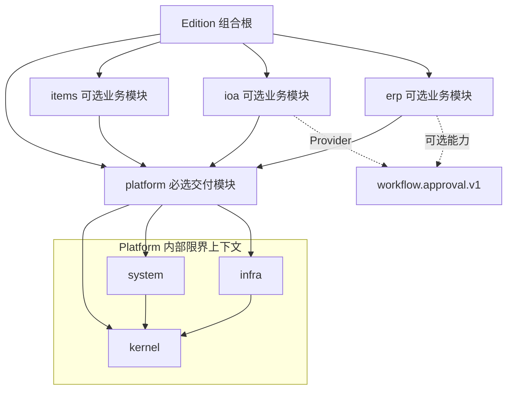
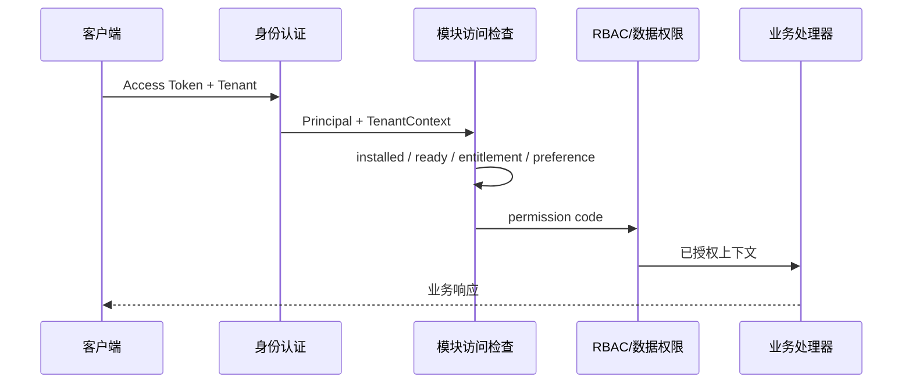

# 模块化架构实施基线

> - 状态：实施候选基线 v1.0（技术验收完成，治理签署待办）
> - 基线提交：`c3bcfa5`
> - 更新日期：2026-07-20
> - 适用范围：Fast Vben Admin 平台基座、Items 样板模块及后续 IOA、ERP 模块

本文是[模块化产品架构规划](./modular-product-architecture.md)的实施配套，负责定义可以直接拆分为开发任务和验收项的工程基线。架构原则和历史决策仍以 [ADR 索引](./adr/README.md)为准；本文与已接受 ADR 冲突时，以 ADR 为准，并通过新增 ADR 修订本文。

本基线已经固定 Platform 粒度、Edition 制品、事件状态机、租户数据库边界和运行期降级策略，分别见 ADR-0010 至 ADR-0014。文中不再保留影响实现兼容性的选择项；尚未完成的是代码落地与验收，而不是目标架构决策。

## 1. 实施结论

项目继续采用“模块化单体 + 构建期 Edition 组合”，当前阶段不拆微服务、不引入运行时微前端，也不维护产品分支。

实施顺序固定为：

1. 先修正模块授权、请求鉴权和 Outbox 的正确性。
2. 再闭合 Edition 的前端、后端、数据库和镜像构建链路。
3. 增加自动租户隔离，降低新增查询造成越权的风险。
4. 将过重的 Platform 渐进拆成平台内核、系统能力和基础设施能力。
5. Items 通过全部验收后，才以它为模板建设 IOA、ERP。

第一阶段完成前，Items 是唯一允许继续完善的业务样板模块，不新增第二种模块接入方式。

## 2. 当前基线与目标差距

当前已经具备：

- Edition YAML、Build Manifest 和摘要校验。
- 按 Edition 装配后端 Router。
- 独立模块 Schema、Alembic 环境和版本表。
- 模块访问、套餐权益、租户偏好和 RBAC 的分层判断。
- 模块级 OpenAPI 客户端和前端页面映射生成。
- `public_api`、平台公开接口和 AST 导入边界测试。
- Outbox、重试、死信和消费者回执的基础模型。

本轮优先差距与落实情况：

| 编号 | 差距 | 目标状态 | 进度 |
| --- | --- | --- | --- |
| G1 | 新模块会默认给已有套餐开通 | 新模块权益默认关闭，只能显式授予 | 已完成 M1 |
| G2 | 请求鉴权会同步运行时记录并写数据库 | 请求鉴权为纯读取，运行时同步由部署命令执行 | 已完成 M1 |
| G3 | 无消费者事件会被标记为已发布 | 只有完成声明的投递目标后才能标记成功 | 已完成 M2 |
| G4 | 失败消费者缺少独立事务边界 | 单事件、单消费者的副作用可以完整回滚和安全重试 | 已完成 M2 |
| G5 | 前端 Docker 构建未绑定 Edition | 前后端镜像由同一份 Manifest 构建并校验摘要 | 核心实现完成 M3 |
| G6 | Base 镜像仍包含 Items 源码 | v1 允许包含源码，但不得装配 Items 的任何运行入口 | 核心实现完成 M3 |
| G7 | 租户过滤依赖每条查询手工编写 | Session 自动过滤和写入校验，核心表逐步启用 RLS | Items 与 27 张 Platform 核心/Infra/身份会话及模块权益表完成；OAuth2/OIDC、租户全局表和模块全局运行时表待按可信来源分批迁移 |
| G8 | ModuleDefinition 多数字段未接入组合根 | 声明、实际注册和运行状态一致并由 CI 校验 | 部分完成 M2 |
| G9 | Platform 聚合过多能力 | 平台内核、系统能力和基础设施能力边界清晰 | 模型、Infra、数据库连接及配置/导航/RBAC bootstrap 已拆分；遗留跨上下文服务按新增功能逐步收敛 |

## 3. 架构事实源

各类状态只能有一个人工维护的事实源：

| 信息 | 唯一事实源 | 派生结果 |
| --- | --- | --- |
| Edition 包含的模块 | `editions/<edition>.yaml` | Build Manifest、前后端注册表、构建产物 |
| 模块代码契约 | `ModuleDefinition` | Router、迁移、权限、事件、Worker 注册 |
| 构建版本组合 | `build-manifest.json` | 前后端摘要、部署审计、兼容性检查 |
| 模块期望状态 | `ModuleRegistry.desired_state` | 是否允许运行模块能力 |
| 模块实际状态 | 迁移器和健康检查写入的 `observed_state` | 启动门禁和运维展示 |
| 套餐模块权益 | `TenantPlanModule` | 租户的基础模块权益 |
| 合同例外 | `TenantModuleEntitlementOverride` | 限时授予或收回 |
| 租户启用偏好 | `TenantModule` | 在已有权益内启用或停用 |
| 用户操作权限 | Permission、Role、Menu 关系 | API 和前端按钮授权 |

禁止：

- 通过环境变量临时增加 Edition 未包含的模块。
- 通过菜单是否存在推断模块安装或权益状态。
- 通过数据库中存在某张表推断模块已就绪。
- 由前端 Manifest 覆盖后端 Manifest，或反向覆盖。

## 4. 目标模块边界

### 4.1 模块分层



模块职责：

| 模块 | 拥有能力 | 不应拥有 |
| --- | --- | --- |
| `platform/kernel` | 认证、用户、租户、RBAC、菜单、模块注册、请求上下文 | 文件存储、短信、邮件、具体业务流程 |
| `platform/system` | 部门、岗位、字典、系统参数、公告 | 登录协议、业务单据、通用存储实现 |
| `platform/infra` | 文件、存储、短信、邮件、日志、消息 Transport | 组织权限、采购、审批业务状态 |
| `items` | 样板业务 CRUD、导入导出 | 平台 ORM、通用模块基础设施 |
| `ioa` | 流程、待办、办公协同、审批 Provider | ERP 单据和库存状态 |
| `erp` | 采购、销售、库存、结算 | IOA 内部实现和流程表 |

`kernel`、`system`、`infra` 在 v1 中都是 Platform 内部包，不进入 Edition YAML，不独立授权，也不维护独立模块版本。第一轮先形成代码和导入边界，不迁移 Platform 现有 `public` Schema。只有出现独立授权、发布、扩容或合规隔离要求时，才通过新 ADR 把内部上下文提升为 Edition 模块。

### 4.2 允许的依赖方向

```text
composition root
  -> module implementation
  -> declared dependency.public_api
  -> platform.public_api / platform.web_api
  -> stable technical libraries
```

强制规则：

- 业务模块不能导入 `app.models`、`app.crud`、`app.api`。
- 业务模块只能从平台的 `public_api` 和 `web_api` 获取平台能力。
- 业务模块只能导入已声明依赖模块的 `public_api`。
- 可选模块之间不能形成 Python import 依赖。
- 公开 DTO 不能包含 ORM、Session、Request 或第三方 SDK 对象。
- 平台核心不能导入具体业务模块；组合根和生成注册表除外。

现有 [test_module_boundaries.py](../backend/tests/modules/test_module_boundaries.py) 继续作为最低门禁，后续增加事件、权限和 Schema 所有权检查。

## 5. 目标目录

### 5.1 后端

```text
backend/app/
  composition/
    registry.py
    lifecycle.py
    capabilities.py
    events.py
  platform/
    module.py
    public_api/
    web_api.py
    kernel/
    system/
    infra/
  modules/
    contracts.py
    manifest.py
    access.py
    migrations.py
    items/
      module.py
      public_api/
        dto.py
        events.py
        queries.py
        commands.py
      domain/
      application/
        ports.py
        services/
      infrastructure/
        models.py
        repositories.py
      routes/
      permissions.py
      menus.py
      migrations/
```

迁移期间允许 `platform` 继续使用现有目录，但新业务代码不得写回 `app.models`、`app.crud` 和 `app.api.routes`。

### 5.2 前端

```text
frontend/apps/web-antd/src/
  platform/
    api/
    views/
  modules/
    build-manifest.ts
    generated-registry.ts
    items/
      module.ts
      api/
        generated/
        index.ts
      views/
      components/
      locales/
```

前端模块只能导入本模块 API、平台公开 API 和共享 UI 包。业务模块之间的页面或 API 不能相互导入。

## 6. ModuleDefinition 落地契约

目标结构如下，字段名可以随实现微调，但语义不得退化为字符串列表和 import 副作用：

```python
@dataclass(frozen=True)
class ModuleDefinition:
    code: str
    version: str
    api_prefix: str
    permission_prefix: str
    dependencies: tuple[ModuleDependency, ...]
    routers: tuple[RouterSpec, ...]
    migration: MigrationSpec
    permissions: tuple[PermissionSpec, ...]
    menus: tuple[MenuSpec, ...]
    published_events: tuple[PublishedEventSpec, ...]
    event_consumers: tuple[EventConsumerSpec, ...]
    capability_providers: tuple[CapabilityProviderSpec, ...]
    capability_requirements: tuple[CapabilityRequirement, ...]
    reference_guards: tuple[ReferenceGuardSpec, ...]
    configuration: ConfigSpec
    workers: tuple[WorkerSpec, ...]
    schedules: tuple[ScheduleSpec, ...]
    lifecycle: LifecycleHooks
```

组合根在启动或构建时验证：

- 模块编码、版本和依赖图合法且无环。
- Router 路径属于模块 API 前缀。
- 权限码属于模块权限前缀。
- 菜单引用的权限和前端组件存在。
- 数据表属于模块声明的 PostgreSQL Schema。
- 实际发布事件均已声明，消费者版本兼容。
- 必选能力存在且只有一个确定 Provider。
- ReferenceGuard、Worker、Schedule 已被实际注册。
- 必填配置存在，Secret 只声明引用而不进入 Manifest。
- 生命周期钩子执行失败会使模块进入 `DEGRADED`。

禁止在 `module.py` 导入时修改全局字典。ReferenceGuard、事件消费者和 Provider 作为声明对象交给组合根注册。

能力 Provider 的选择顺序固定为：

```text
业务实例显式绑定
  > 当前租户 capability policy
  > Edition 默认 Provider
  > 唯一健康 Provider
  > CAPABILITY_UNAVAILABLE
```

长生命周期实例创建时保存 `provider_code`、`provider_version` 和外部实例标识。Provider 后续禁用或变更不能让既有实例自动切换。能力命令必须定义幂等键、超时、稳定错误码和是否允许业务补偿；本地 Provider 也遵循相同契约。

## 7. 请求访问链路

业务 API 的访问顺序固定为：



请求链路的硬约束：

- Manifest 在进程启动时加载并校验一次，请求中不能重复读取 Edition YAML。
- 模块访问检查不得插入、更新或 `flush` 任何数据库记录。
- 模块注册同步只在迁移、prestart 或显式管理命令执行。
- 超级管理员可以绕过业务 RBAC，但不能绕过未安装、未就绪和无权益状态。
- 权限错误使用稳定错误码，不能依赖英文错误消息映射。
- 模块状态或权益变化后，统一失效 RBAC 和模块访问缓存。

访问判定由单一 `ModuleAccessRepository` 在一次数据库查询中返回模块状态、套餐权益、合同覆盖和租户偏好。允许使用 Redis 缓存完整判定，但必须满足：

- Cache key 包含租户授权版本和 Manifest digest。
- 状态或权益事务提交后递增授权版本，再发布失效通知。
- Redis 不可用时回源数据库，不能因为缓存异常放行。
- 数据库不可用时失败关闭。
- 缓存实现不得改变判定顺序和错误码。

模块权益计算顺序：

```text
有效的合同覆盖
  > 有效套餐模块配置
  > 默认无权益
```

租户偏好只能在已有权益内关闭或开启模块，不能创造权益。新增业务模块对所有已有套餐默认 `disabled`。

## 8. 多租户隔离

### 8.1 模型分类

所有持久化模型必须明确属于以下一种：

- `TenantOwned`：数据只能被单个租户访问。
- `PlatformGlobal`：平台全局数据，仅平台管理接口访问。
- `ModuleRuntime`：模块运行状态和构建信息。

禁止使用“模型没有 `tenant_id`，所以它是全局表”的隐式约定。

### 8.2 Unit of Work

租户数据访问的唯一入口是 `TenantUnitOfWork(tenant_id)`：

- API 从验证后的 TenantContext 创建 UoW。
- Event Consumer 从可信事件信封创建 UoW。
- Schedule 先取得待处理租户列表，再逐租户创建 UoW。
- CLI 必须显式传入 tenant_id，或使用受审计的 PlatformUnitOfWork。
- 缺少 tenant_id 时失败关闭。

`ContextVar` 只负责在调用链传播当前 UoW，不是租户身份的事实源。业务模块不能取得 PlatformUnitOfWork 工厂。

### 8.3 ORM 与数据库防护

- Session 对 `TenantOwned` 自动应用 `with_loader_criteria`。
- `before_flush` 校验新增、更新和关联对象的 tenant_id。
- Tenant UoW 禁止 ORM bulk update/delete 和未包装 raw SQL。
- Items 和所有新业务模块表启用 `ENABLE/FORCE ROW LEVEL SECURITY`。
- `app_runtime` 每个事务使用 `SET LOCAL app.tenant_id`，设置缺失时 RLS 拒绝访问。
- 连接归还池前必须结束事务，禁止使用跨事务 session-level `SET`。

当前部署已启用的数据库角色为：

| 角色 | 用途 | 已验证限制 |
| --- | --- | --- |
| `app_runtime` | API、Worker、Schedule | 非超级用户、不能建库/建角色、无 `BYPASSRLS`；Compose 和 CI 已使用该角色 |
| 部署管理员凭据 | prestart 迁移、角色授权和播种 | 不注入 API、Worker 或 Schedule 进程 |

下列角色是目标部署模型，不是当前已启用事实；只有在凭据轮换、独立连接池、审计和 N-1 演练均完成后才能标记为启用：

| 角色 | 目标用途 | 启用前验收 |
| --- | --- | --- |
| `app_platform` | 受审计的跨租户平台操作 | 独立连接池、只允许显式目标租户 UoW、跨租户 CLI/HTTP 写入审计 |
| `app_migrator` | DDL 和迁移 | 迁移作业改用专用短期凭据，应用进程不可获取 |
| `app_readonly` | 受控运维查询 | 只读授权、有效期与访问审计 |

现有 Platform 租户表按独立迁移计划逐步接入 RLS；完成前继续保留显式 tenant 条件和跨租户负向测试。详细规则见 [ADR-0013](./adr/0013-tenant-unit-of-work-and-rls.md)。

### 8.4 自动检查

- AST 测试检查业务租户模型继承 `TenantOwned`。
- Repository 的读取、更新、删除都执行跨租户负向测试。
- API、Worker、Schedule 共用同一套租户隔离契约测试。
- HTTP 平台跨租户写操作必须产生操作审计；CLI 和运维路径在启用 `app_platform` 前不得宣称已达到同等审计保证。

## 9. 事件与 Outbox

### 9.1 事件信封

所有跨模块事件使用统一信封：

```json
{
  "event_id": "uuid",
  "event_type": "platform.user.archived",
  "event_version": 1,
  "tenant_id": "uuid-or-null",
  "aggregate_id": "stable-id",
  "occurred_at": "RFC3339 timestamp",
  "trace_id": "trace-id",
  "payload": {}
}
```

事件类型和版本分字段保存，`event_type` 不再混用 `.v1` 后缀。

### 9.2 投递语义

事件、投递目标和消费回执分开建模：

```text
OutboxEvent: pending / complete / dead_letter
  -> EventDelivery(local_consumer): pending / processing / delivered / dead_letter
  -> EventDelivery(external_broker): pending / processing / delivered / dead_letter

InboxReceipt: UNIQUE (consumer_name, event_id)
```

- 业务状态、OutboxEvent 和初始 EventDelivery 在同一事务提交。
- Worker 在短事务内写入 `locked_by/locked_until` 领取 Delivery，避免处理期间长期持有数据库锁。
- 本地消费者在自己的模块事务中提交业务副作用和 InboxReceipt。
- Inbox 提交后再确认 Delivery；两者之间崩溃时，重试通过 InboxReceipt 跳过重复副作用并完成确认。
- 外部 Broker Delivery 只有收到 Broker ACK 后才进入 delivered。
- 所有 required Delivery 成功后 OutboxEvent 才进入 complete。
- required Delivery 死信会使事件死信；optional Delivery 失败只告警，不阻塞事件完成。
- 没有 Delivery target 且未显式声明 `allow_zero_subscribers` 的可靠事件在构建时失败。
- `allow_zero_subscribers` 只表示当前 Edition 无消费方时事件可完成，不允许用于业务上必须产生下游状态的事件。
- 禁用消费者模块时对应 Delivery 保持 pending，不增加失败次数。
- 同一 aggregate 要求顺序时携带单调 `aggregate_sequence`，前序 required Delivery 完成前不领取后序事件。

不再使用 `PUBLISHED` 同时表达 Transport ACK 和消费者处理完成。完整状态机见 [ADR-0012](./adr/0012-outbox-delivery-inbox-state-machine.md)。

### 9.3 契约检查

CI 从代码和 ModuleDefinition 比较：

- 未声明的事件不能发布。
- required 事件必须存在消费者或外部 Transport。
- 同一消费者名称在全局唯一。
- 相同事件的主版本必须兼容。
- 重复投递测试不能产生重复业务副作用。
- 模拟消费者在写入后崩溃，重试后结果仍然正确。
- 租约超时后其他 Worker 可以重新领取。
- 同 aggregate 顺序测试不会发生越序消费。

## 10. 数据与迁移

每个业务模块拥有：

- 独立 PostgreSQL Schema。
- 独立 Alembic 目录。
- 独立版本表 `public.alembic_version_<module>`。
- 声明的表所有权清单。

迁移顺序由模块依赖拓扑决定，`platform` 始终最先执行。迁移由独立一次性 prestart Job 执行，整个 Edition 迁移受 PostgreSQL advisory lock 保护，但每个模块独立记录状态。Manifest 包含的模块无论 desired_state 是否启用都迁移到声明版本，API 实例启动时只验证迁移结果，不执行迁移。

运行状态中的 `actual_revision` 必须保存数据库真实 revision，例如 `items_rename_tenant_index`，不能保存 `items-head` 这类占位值。启动门禁比较：

```text
manifest migration_heads == database current_heads == module observed revision
```

迁移失败时：

- 把当前模块标为 `DEGRADED`，保留已经完成的前置模块状态。
- 整个新版本部署失败，新 API 实例不得进入 readiness。
- 滚动发布中的旧版本继续服务，不能启动部分完成迁移的新版本。
- 输出明确的失败模块、revision 和前向恢复命令。

运行期业务模块依赖故障与迁移失败分开处理：`platform` 或数据库故障使实例退出 readiness；业务模块故障只把该模块置为 degraded，其 API 返回 503，并暂停相应 Worker 和 Schedule。现有版本实例重启时允许隔离 degraded 业务模块继续提供 Platform；发布控制器仍禁止有迁移失败模块的新版本 rollout。详细规则见 [ADR-0014](./adr/0014-deployment-readiness-and-runtime-degradation.md)。

跨模块不得建立数据库外键。平台主数据引用保存稳定 ID 和必要快照，并通过 ReferenceGuard 控制破坏性操作。

### 10.1 发布与回退

- 生产迁移采用 expand-contract：先增加兼容结构，再切换读写，最后在后续版本删除旧结构。
- 每次发布保证数据库同时兼容 N 和 N-1 后端；破坏性 contract 至少跨一个发布版本完成。
- 模块停用和 Edition 移除只停止装配，不自动删除 Schema、表、事件和历史数据。
- 应用镜像只能回退到兼容当前数据库 revision 的版本。
- 需要数据修复时发布新的前向迁移，不依赖生产环境执行 Alembic downgrade。
- 每次发布记录 Manifest、镜像摘要、迁移前后 revision 和数据备份标识。
- 迁移开始后发生失败，恢复流程必须先判断失败模块是否已经提交不可逆 DDL，再决定重试、前向修复或恢复备份。

生产发布顺序固定为：

1. 在生产快照副本验证 N-1 到 N 的迁移和回滚兼容矩阵。
2. 确认 PITR 正常并记录发布前恢复点。
3. 执行唯一 prestart migration Job。
4. 滚动部署 N 后端 API，确认 readiness 和核心冒烟测试。
5. 部署 N Worker 和 Schedule。
6. 最后发布 N 前端静态资源。
7. 观察稳定窗口后允许执行后续 contract 清理迁移。

回退优先回退应用和前端；数据库只前向修复。只有经过演练且确认数据恢复范围时才执行备份恢复。

## 11. Edition 构建协议

v1 后端镜像允许包含全部模块源码，Edition 的运行边界由构建期静态注册表保证。未启用模块不得注册 Router、Worker、Schedule、事件消费者和迁移。只有未来出现私有源码交付要求时才拆独立 wheel，当前不通过删除源码目录制造物理隔离。

前端生产 dist 只包含当前 Edition 的静态入口。模块级 OpenAPI 客户端按模块提交仓库，CI 重新生成并检查 drift；组合 OpenAPI 只用于文档和兼容性验证，不再生成共享客户端。详细决策见 [ADR-0011](./adr/0011-edition-artifact-and-manifest-v2.md)。

### 11.1 Manifest v2

构建 Manifest 使用确定性 Schema：

```json
{
  "schema_version": 2,
  "edition": "items",
  "source_revision": "git-commit-sha",
  "platform_contract_version": 1,
  "modules": [
    {
      "code": "platform",
      "version": "1.0.0",
      "migration_namespace": "platform",
      "migration_heads": ["revision-id"],
      "openapi_sha256": "sha256:..."
    }
  ],
  "manifest_digest": "sha256:..."
}
```

模块按依赖拓扑和编码稳定排序。构建时间、镜像 digest、SBOM 地址和签名等非确定性信息进入独立 `artifact-metadata.json`，不参与 Manifest canonical digest。

### 11.2 唯一入口

目标命令如下，实施完成前不得在文档中宣称已经可用：

```powershell
pnpm build:edition -- --edition base
pnpm build:edition -- --edition items
pnpm build:edition -- --edition suite
```

命令按固定顺序执行：

1. 校验 Edition YAML 和依赖图。
2. 生成不可变 `build-manifest.json`。
3. 生成后端模块注册表。
4. 生成平台和模块 OpenAPI 契约及客户端。
5. 生成前端模块注册表和页面映射。
6. 对当前 Edition 执行后端检查、前端类型检查和构建。
7. 构建前后端镜像，并把同一 Manifest 写入两个镜像。
8. 启动镜像，比较前后端摘要并执行冒烟测试。
9. 输出制品清单和摘要。

### 11.3 制品要求

```text
output/<edition>/<version>/
  build-manifest.json
  openapi/
    platform.json
    <module>.json
  frontend-dist/
  artifact-metadata.json
  sbom.spdx.json
  checksums.txt
```

必须满足：

- 前端不能包含未启用模块的页面入口和 API 客户端引用。
- 后端不能注册未启用模块的 Router、Worker、Schedule 和事件消费者。
- Base 后端即使包含 Items 源码，也不能装配或执行 Items 的任何运行入口。
- 前端启动前或首次加载时校验后端 Manifest 摘要；不一致时显示明确的版本错误页，不能只返回空菜单。
- 生产环境设置 `BUILD_MANIFEST_PATH`，禁止根据运行时默认值重新生成 Manifest。
- 镜像 OCI label 记录 Edition、source revision 和 Manifest digest。
- 发布镜像生成 SBOM、执行依赖与镜像漏洞扫描，并由 CI 身份签名。

源码物理隔离明确不属于 v1 Definition of Done，不能把它作为阻塞业务模块交付的隐含要求。

## 12. 可观测性与运维

### 12.1 工程 SLO

以下是 v1 初始工程预算；上线取得四周基线后可以通过 ADR 调整，不能直接删除：

| 指标 | 目标 | 告警 |
| --- | --- | --- |
| 核心管理 API 可用性 | 月度 99.9% | 5 分钟窗口低于 99% |
| 常规 API 延迟 | p95 < 300 ms，p99 < 800 ms | 连续 10 分钟超标 |
| 模块访问检查额外开销 | 缓存命中 p95 < 5 ms；回源 p95 < 20 ms | 连续 10 分钟超标 |
| Outbox required Delivery | 99% 在 60 秒内 delivered | 最老 pending > 5 分钟 |
| Dead letter | 正常为 0 | 新增即告警 |
| Edition CI 构建 | 单 Edition < 15 分钟 | 连续三次超标 |
| 在线 DDL 阻塞 | `lock_timeout=5s` | 超时使迁移失败，不持续等待业务锁 |
| RPO | 5 分钟 | PITR 链路异常 |
| RTO | 60 分钟 | 恢复演练超标 |

数据库每日全量备份并持续归档 WAL；至少每季度执行一次隔离环境恢复演练并记录实际 RPO/RTO。

月度 99.9% 可用性对应约 43 分钟错误预算。月中过半前消耗超过 50% 时暂停高风险功能发布；预算耗尽后只允许可靠性、安全修复和已经批准的紧急变更。每个告警必须关联 Owner、处理 Runbook 和升级路径。

### 12.2 模块指标与健康

每个模块至少暴露：

- `desired_state`、`observed_state`、版本和 revision。
- 最近迁移时间、最近健康检查时间和错误摘要。
- Outbox pending、retry、dead-letter 数量和最老事件年龄。
- 模块 API 请求量、错误率和延迟。
- 当前启用租户数和权益拒绝次数。

健康检查分层：

| 检查 | 用途 | 失败行为 |
| --- | --- | --- |
| Liveness | 进程是否存活 | 允许容器重启 |
| Readiness | Platform 和共享依赖是否可服务 | 从流量入口摘除 |
| Module health | 单个业务模块依赖是否正常 | 隔离模块并返回 503，不影响 Platform readiness |

v1 中 PostgreSQL、Manifest/注册表一致性和 Platform migration revision 属于 readiness 关键依赖。Redis、对象存储、SMTP、短信渠道、Sentry 和业务模块外部 Provider 默认属于可降级依赖：受影响功能返回稳定的 unavailable 错误，不能把故障伪装为成功，也不因此关闭无关 Platform API。新增依赖必须在 ConfigSpec 中明确标注 `critical` 或 `degradable`。

模块管理界面至少支持查看状态、启停业务模块、配置套餐权益、查看死信和触发受控重试。`platform` 不允许通过普通模块管理接口停用。

### 12.3 安全与供应链

- 生产 Secret 只通过密钥管理服务或部署平台注入，不进入镜像、Manifest 和日志。
- 应用、平台管理、迁移和只读运维使用不同数据库角色。
- Manifest digest 用于一致性，镜像签名和 CI provenance 用于真实性，二者不能互相替代。
- CI 生成 SBOM，执行依赖、容器和 Secret 扫描；高危漏洞阻断发布，例外必须有期限和批准记录。
- 模块状态、权益、死信重试、跨租户操作和物理数据处理全部写入不可由普通租户修改的审计日志。
- 错误响应和事件错误摘要不得包含 Token、Secret、验证码或完整个人敏感信息。

## 13. CI 质量门禁

### 13.1 Edition 矩阵

```yaml
edition: [base, items, erp, suite]
```

这是当前已交付模块矩阵。IOA 合入前必须增加 `ioa` Edition 并把它加入同一矩阵；`suite` 始终代表所有已交付业务模块的组合，当前包含 Items 和 ERP。

每个 Edition 执行：

- 从空 PostgreSQL 数据库迁移到 head。
- 从最近一个生产版本执行 N-1 到 N 升级。
- 重复迁移验证幂等。
- 后端启动和 readiness 检查。
- 路由集合和 OpenAPI 路径快照。
- 前端 API 生成、类型检查和生产构建。
- 前后端 Manifest 摘要一致性检查。
- 菜单组件存在性检查。
- Docker 镜像启动和登录冒烟测试。
- 未启用模块没有 Router、Worker、Schedule、消费者和迁移入口。
- Manifest v2、SBOM、OCI label 和镜像签名元数据完整。

### 13.2 分层测试

测试必须分层，不能让架构测试依赖数据库：

```text
unit / architecture      不启动 PostgreSQL
repository / migration  使用临时 PostgreSQL
api integration         使用临时 PostgreSQL 和 Redis
edition smoke           使用构建后的镜像
e2e                     使用完整 Compose
```

数据库 fixture 不再全局 `autouse`。本地测试使用 `.env.test`、显式环境变量或 Testcontainers，不能默认使用 Docker 网络主机名 `db`。

### 13.3 契约门禁

- OpenAPI 破坏性变更检查。
- 公开 DTO 和事件 Schema 兼容性检查。
- 权限码重复、越界和孤儿菜单检查。
- 模块依赖图和非法 import 检查。
- Schema/table 所有权检查。
- 租户数据泄漏负向测试。
- Outbox 崩溃恢复和重复投递测试。
- RLS 缺少 tenant setting、Worker、Schedule 和 bulk DML 绕过测试。
- N/N-1 数据库兼容和发布顺序冒烟测试。

## 14. 分阶段实施计划

每个阶段独立提交、独立验收，不把 Platform 拆分和功能开发混入正确性修复。

| 阶段 | Milestone | Owner | Reviewer | 依赖 | 当前状态 | Exit Evidence |
| --- | --- | --- | --- | --- | --- | --- |
| A：访问控制纯化 | M1 | Backend Lead | Architecture Owner | 无 | 已完成，待提交 | 访问 SQL 只读证据和权益矩阵测试 |
| B：可靠事件基础设施 | M2 | Backend Lead | Architecture Owner | A | 核心实现完成，待提交 | ADR-0012 状态机、迁移和崩溃恢复测试 |
| C：Edition 构建闭环 | M3 | DevOps Lead | Backend/Frontend Lead | A、B | 制品与供应链工作流已落地，远端镜像门禁待验证 | 三种 Edition 制品、签名和冒烟报告 |
| D：租户隔离纵深防御 | M2 | Security/Backend Lead | Architecture Owner | A | Items 与 27 张 Platform 核心/Infra/身份会话及模块权益表已接入；OAuth2/OIDC、租户全局表和模块全局运行时表待按可信来源分批迁移 | ADR-0013 契约测试和 RLS 策略清单 |
| E：Platform 内部拆分 | M4 | Platform Lead | Architecture Owner | A、D | Infra、全部持久化模型、数据库连接和配置/导航/RBAC bootstrap 已迁移；遗留跨上下文服务按新增功能收敛 | 内部导入边界和 Platform 回归报告 |
| F：Items 样板封板 | M5 | Items Owner | Backend/Frontend Lead | A-E | 进行中 | 完整 Definition of Done 证据包 |

阶段按依赖关系执行；B 和 D 可以在 A 完成后并行，C 需要使用稳定的访问和事件契约，F 是最终封板而不是独立功能阶段。Milestone 表示顺序而非自然日期，启动实施前由项目计划映射到具体迭代和截止日期。状态只在对应验收项进入 CI 并稳定通过后更新，不能以代码文件已经创建作为完成依据。角色对应的具体人员由项目 CODEOWNERS 或迭代计划维护。

### 阶段 A：访问控制纯化

改造范围：

- `backend/app/modules/access.py`
- `backend/app/api/deps.py`
- `backend/app/api/routes/modules.py`
- 模块访问与套餐权益测试

任务：

- 新模块默认无套餐权益。
- 将运行时同步提取为显式 reconcile 服务和命令。
- 启动时加载 Manifest，访问依赖只读缓存和数据库状态。
- 为平台内核增加不可停用保护。

验收：

- 连续调用业务 API 不产生 `INSERT`、`UPDATE`、`FLUSH`。
- 缓存未命中时模块访问状态由一次 SQL 查询返回，Redis 故障时正确回源。
- 新增模块后所有已有套餐保持关闭。
- 合同覆盖、套餐权益、租户偏好和 RBAC 的优先级测试通过。
- Platform 停用请求返回稳定错误码。

### 阶段 B：可靠事件基础设施

改造范围：

- `backend/app/modules/outbox.py`
- `backend/app/modules/outbox_worker.py`
- ModuleDefinition 事件声明
- Outbox、Inbox、死信测试

任务：

- 实现每事件和每消费者事务边界。
- 由组合根注册消费者，取消 import 副作用。
- 对齐实际事件与声明事件。
- 定义零消费者和外部 Transport 语义。

验收：

- 消费者写数据库后抛异常，数据库副作用不会提交。
- Worker 崩溃后事件可重新领取且不重复执行业务动作。
- 没有 target 且未显式允许零订阅者的可靠事件在构建时失败。
- 所有 required Delivery 成功后事件才进入 `complete`。
- 所有平台主数据生命周期事件有版本化 DTO。

当前实现证据：

- `a2d4e6f8b0c1` 将旧 Outbox 迁移为 `OutboxEvent`、`EventDelivery`、`InboxReceipt` 三层模型。
- API 与独立 Worker 都从 Composition Root 装配 Event handler，并校验 `ModuleDefinition` 事件契约。
- `backend/tests/modules/test_outbox.py` 覆盖 required/optional、Broker ACK、幂等回执、消费者回滚、零订阅、禁用消费者和租约回收。

### 阶段 C：Edition 构建闭环

改造范围：

- 根 `package.json`
- `scripts/`
- 前后端 Dockerfile
- Compose 和 GitHub Actions
- 前端生成注册表

任务：

- 实现统一 `build:edition`。
- 前后端使用同一构建 Manifest。
- 对 Base、Items、Suite 分别构建和启动。
- 生成 Edition 制品清单和摘要。

验收：

- `base` 前后端可以完整登录和加载菜单。
- `items` 和 `suite` 可以访问 Items。
- 交换任意两个 Edition 的前后端镜像会得到明确版本错误。
- Base 后端不存在 Items Router、Worker、Schedule、消费者和迁移入口，前端不存在 Items 页面入口。
- Manifest v2 包含真实 migration heads、OpenAPI 摘要和 source revision。

当前实现证据：

- `pnpm build:edition -- --edition <base|items|erp|suite>` 生成后端只读 Manifest、前端静态注册表和 `artifact-metadata.json`；`--images` 同时构建并标注 OCI 镜像。
- Manifest v2 的 canonical digest 覆盖 source revision、模块 migration head 和模块 OpenAPI 摘要；前端在加载菜单前比较后端摘要，不一致即中断路由装配。
- 本地已完成 Base、Items、Suite 的前端构建，其中 Base 的 `modulePageMap` 为空，Items 与 Suite 只注册 Items 页面。Docker 镜像冒烟仍需在可访问基础镜像仓库的构建环境执行。
- `.github/workflows/release-supply-chain.yml` 对 Base、Items、Suite 并行构建前后端镜像，执行数据库迁移和容器健康冒烟，生成 CycloneDX SBOM，并以 Trivy 阻断 HIGH/CRITICAL 漏洞；版本标签发布到 GHCR 后使用 GitHub OIDC 进行 Cosign keyless 签名与 SBOM attest。工作流已通过 YAML 解析，本地重新生成三种后端制品成功；远端扫描、推送和签名结果仍须由 GitHub Actions 证明。

### 阶段 D：租户隔离纵深防御

改造范围：

- 租户模型基类和 Session 工厂
- 平台管理专用 Session
- Items Repository
- 租户隔离迁移与测试

任务：

- 引入 `TenantOwned` 和 `PlatformGlobal`。
- 实现 TenantUnitOfWork、自动查询过滤和写入校验。
- Items 启用并强制 RLS，Worker 和 Schedule 使用相同 UoW。
- 收敛 Raw SQL 使用入口。

验收：

- 删除业务代码中的租户 where 条件后，Repository 测试仍不能跨租户读取。
- 伪造其他租户 ID 的新增和更新在 flush 前失败。
- 平台跨租户管理必须使用独立入口并产生审计记录。
- 未设置 `app.tenant_id`、bulk DML 和 raw SQL 绕过测试失败关闭。

当前实现证据：

- Items 路由通过 `ItemsTenantUnitOfWork` 和 `ItemsRepository` 访问数据，不再在 Repository 中手工拼装 `tenant_id` 条件。
- `items_enable_tenant_rls` 已为 `items.item` 启用并强制 PostgreSQL RLS；事务开始时设置 `app.tenant_id`，ORM 读取自动加过滤，flush 校验租户归属和不可变性。
- `backend/tests/modules/items/test_tenant_uow.py` 覆盖跨租户读取、跨租户写入和 ORM bulk DML 的失败关闭。现有 Platform 租户表仍按阶段计划逐表迁移，未在本阶段泛化为跨所有历史表的自动拦截器。
- `b6f8c1d2e3a4` 已为 Department、Post、Role、岗位/角色关联、字典、设置、公告和站内消息共 12 张 Platform 运营表启用并强制 PostgreSQL RLS；`d3e7f9a1b2c4` 将文件、邮件和审计的 7 张表纳入强制 RLS；`e4b8c2d6f0a3` 将短信渠道、模板和日志 3 张表纳入强制 RLS；`f5c9d3e7a1b4` 将社交客户端和社交用户 2 张表纳入强制 RLS；`a6d0e4f8b2c5` 将 `UserSession` 纳入强制 RLS；`c7e1a5f9b3d6` 将 `TenantModule` 和 `TenantModuleEntitlementOverride` 纳入强制 RLS，累计 27 张。`PlatformTenantUnitOfWork` 在解析 `CurrentTenant` 后绑定 `app.tenant_id`，自动为查询和 bulk DML 添加租户条件，并在 flush 时拒绝伪造或修改租户归属；最外层 UoW 退出时会清空事务级 GUC，防止 Worker 复用 Session 时残留前一租户。公开注册、租户初始化、受控租户切换、无认证密码恢复和跨租户模块权益管理分别使用显式 `privileged=True` 目标租户 UoW。
- `app.platform.provision_db_roles` 幂等创建 `app_runtime`：该角色无超级用户、建库、建角色或 `BYPASSRLS` 权限。Compose 的 API 和 Worker 使用此运行时角色；prestart 保留管理员凭据执行迁移与授权，再以 `app_runtime` 完成播种。Backend CI 同时以管理员验证迁移、以 `app_runtime` 验证 UoW、模块访问、文件、邮件、审计、登录、短信、社交、租户和用户 API；本地 runtime 门禁为 `96 passed`。
- 短信回调现在要求 `tenant_code` query 参数，先解析活跃租户、绑定 UoW，再按请求 ID 查询日志并验证渠道；这消除了在无租户上下文下读取回调记录的路径。

未纳入 RLS 的表不是遗漏后直接套用同一 policy，而是需要先具备下表所列可信租户来源；在此前，保留显式 tenant 条件、负向测试和受限调用入口：

| 数据类别 | 当前不能直接强制 RLS 的原因 | 前置改造 | 验收证据 |
| --- | --- | --- | --- |
| OAuth2 Client、Authorization Code、Access Token | `/oauth2/token` 在无用户 JWT 时仅持有公开 `client_id` 和客户端凭据，RLS 前必须先确定唯一 tenant | 建立不可由请求参数伪造的 client-to-tenant 解析器，并把解析与 token/code 交换放在同一事务 | 双租户同名/错误 client、refresh、revoke 的 runtime 负向测试 |
| Enterprise OIDC State、Identity、Login Ticket | 当前模型是全局身份关联或无 tenant 字段，不能伪造为 tenant-owned 表 | 明确全局身份边界；仅把带 tenant 的会话/授权投影纳入 RLS | 回调重放、跨租户用户映射和禁用用户回归 |
| TenantMembership、TenantProfile | 登录、租户切换和平台管理需要在 UoW 建立前解析成员关系和生命周期 | 拆出只含解析所需字段的受控目录，或引入受审计平台查询入口 | 无 token、过期租户、跨租户切换与平台列表测试 |
| ModuleStateAudit、Outbox/EventDelivery/Inbox | 存在 `tenant_id IS NULL` 的全局状态，Worker 需要先 claim 再按事件租户处理 | 分离全局控制面与 tenant event stream；每个 tenant event 在 UoW 内执行 | Worker claim、重试、死信与跨租户投递负向测试 |
| CapabilityBinding | 虽有 tenant_id，但通用 capability API 尚未强制接收 UoW | 以 tenant-aware repository/public API 取代裸 Session 调用 | Provider bind/close 的 runtime 读写与 bulk DML 测试 |

### 阶段 E：Platform 内部拆分

任务：

- 第一批迁移文件、存储、短信、邮件、日志到 `infra`。
- 将相关模型、Router、服务和菜单按所有权移动；历史 Alembic revision 保持原位且不可改写。
- 通过 capability 向业务模块提供文件和消息能力。
- 分解集中式 `models.py` 和 `core/db.py`。
- Platform 后续迁移仍使用同一 Alembic 链，但在迁移元数据中标注内部上下文 Owner。

验收：

- Edition 仍只声明一个 `platform`，不出现 `kernel/system/infra`。
- Platform 内核不导入 Infra 实现。
- Infra 不直接访问用户 ORM，通过平台公开接口解析用户信息。
- Alembic metadata 聚合只用于迁移，不成为业务 import 入口。

当前实现证据：

- `backend/tests/architecture/test_import_boundaries.py` 在 CI 级别检查 Items 不导入 `app.models`、平台内部实现或 Router；Platform 核心不导入 Items；`public_api` 不反向导入实现层。
- Items 已通过 `platform.web_api` 获取 Web 集成能力，ReferenceGuard 也已改为 `ModuleDefinition` 声明而非模块导入副作用。
- 文件 Router 和持久化模型已迁入 `platform.infra.files_router`、`platform.infra.file_models`，并通过 `platform.infra.storage` 使用存储能力，底层实现在 `platform.infra.storage_impl`；旧 `app.api.routes.files` 与 `app.storage` 保留兼容转发入口。
- 邮件 Router 和发送适配器已迁入 `platform.infra.mail_router`、`platform.infra.mail`；旧 `app.api.routes.mail` 与 `app.mail` 保留兼容转发入口。审计写入适配器、日志 Router 和模型已迁入 `platform.infra.audit`、`platform.infra.logs_router`、`platform.infra.audit_models`；`app.audit` 保留兼容转发入口。
- 审计日志和短信 Router 已迁入 `platform.infra.logs_router`、`platform.infra.sms_router`；旧 `app.api.routes.logs`、`app.api.routes.sms` 仅保留兼容转发，Platform 组合根直接挂载新 Router。
- 文件、短信、邮件和审计 ORM 模型已物理迁入对应 `platform.infra.*_models`；模块运行时、配置、授权、租户和身份模型分别迁入 `platform.core.runtime_models`、`configuration_models`、`authorization_models`、`tenancy_models` 和 `identity_models`。`app.models` 仅保留兼容导出与尚未按业务上下文归类的通用 API DTO，不再定义 Platform ORM 表。
- `platform.migration_metadata` 为五个 Core 上下文和四个 Infra 上下文声明物理模型模块、表和唯一 Owner；模块权益表归属 `core.module-runtime`，不再错误归属租户上下文。Platform Alembic 环境先装配所有物理模型组，再加载兼容入口；架构测试验证表注册、兼容类型同一性和装配顺序。
- `core.module-runtime`、`core.configuration`、`core.authorization`、`core.tenancy` 和 `core.identity` 的全部生产消费者均已直接依赖物理模型；AST 架构测试扫描整个 `app` 目录，禁止从聚合模型重新导入已迁移类型，并禁止 `platform/core` 反向导入 `app.models`、Infra、Router 或业务模块。历史从 `app.models` 间接导入时钟的路径也已清除。Platform 与 Items 的 Alembic drift 检查均无新增操作。
- 数据库连接已迁入 `core.database`，默认租户、菜单、权限、配置和基础设施播种迁入 `platform.bootstrap`；所有生产代码已离开旧 `core.db`，该文件只保留兼容转发。架构测试会拒绝新的生产导入重新使用该 facade。
- 字典、设置、文件存储、短信、邮件和站内消息模板的默认数据播种已进一步迁入 `platform.bootstrap_configuration`；`platform.bootstrap` 仅作为租户/RBAC/菜单与子 bootstrap 的组合根。架构测试禁止组合根重新直接导入配置或基础设施 ORM。
- `platform_table_owners()` 为每张 `public` schema 的 Platform 表声明唯一内部 Owner，并由架构测试拒绝遗漏或重复归属；`items.item` 由 Items namespace 管理，不参与 Platform 所有权清单。
- 本地完整后端回归已执行 `226 passed`（含 Items 迁移、RLS、访问、事件与 Platform API）；Items migration 测试和 Edition CI 均比较脚本目录的实际 head，不再硬编码过期 revision。
- 数据库 fixture 已取消全局 `autouse`，API client 和数据库测试显式声明依赖；架构与模块边界测试已在不提供 PostgreSQL 主机变量的环境下独立通过。
- `core.configuration` 拆分后，架构/模块边界测试在无数据库主机变量时执行 `20 passed`；配置、公告、站内消息、文件、登录和租户相关接口回归执行 `62 passed`，Platform 与 Items Alembic drift 均未检测到新操作。
- `core.authorization` 拆分后，架构/模块边界测试在无数据库主机变量时执行 `21 passed`，RBAC、用户、组织主数据、登录和租户重点回归执行 `89 passed`；随后完整后端回归执行 `223 passed`，Platform 与 Items Alembic drift 均未检测到新操作。
- `core.tenancy` 拆分后，架构/模块边界测试在无数据库主机变量时执行 `22 passed`，租户、登录、用户、模块权益、通知和社交重点回归执行 `96 passed`；`core.identity` 拆分后边界测试执行 `23 passed`，登录、OAuth2、社交、用户、租户、文件和审计重点回归执行 `93 passed`。该阶段完整后端回归执行 `225 passed`，两套 Alembic drift 均未检测到新操作。
- `core.database`/`platform.bootstrap` 拆分后，架构/模块边界测试在无数据库主机变量时执行 `24 passed`，完整后端回归执行 `226 passed`；Platform 与 Items Alembic drift 均未检测到新操作。
- `platform.bootstrap` 已进一步拆为 `bootstrap_configuration`、`bootstrap_navigation` 和 `bootstrap_rbac`；组合根只编排默认租户与播种顺序，`core.db` 仅保留直接转发的兼容 facade。AST 架构测试验证组合根不再依赖配置、授权或基础设施实体，当前架构测试 `19 passed`、完整后端回归 `229 passed`。
- 本地已顺序完成 `base`、`items`、`suite` 的前端生产构建；三个 Build Manifest 分别包含预期模块集合，最终工作区生成态为 `suite`。镜像、SBOM、签名和远端供应链扫描仍由受保护分支 CI 执行。
- 架构测试同时锁定 Platform 组合根必须挂载 `files_router`、`logs_router`、`mail_router`、`sms_router`，并验证四个旧 Router 路径只作为兼容 facade 存在。

### 阶段 F：Items 样板封板

Items 必须具备：

- 完整目标目录结构。
- 模块自有模型、Repository、路由、菜单、权限和迁移。
- 模块公开 DTO 与事件。
- 前端模块入口、API、页面和国际化。
- 多租户、RBAC、数据权限、导入导出测试。
- Base/Items/Suite 独立构建和启动测试。

Items 封板后创建模块模板和检查清单，IOA、ERP 只能从该模板开始。

当前实现证据：

- Items 已拥有独立 Schema、Alembic namespace、Repository、TenantUnitOfWork、RLS policy、公开 DTO 与 `ItemChangedV1` 版本化事件 schema。
- ModuleDefinition 声明 Items 的路由、权限、ReferenceGuard 和 `items.item.changed@1` 发布契约；业务事件尚未发布，因为当前 Edition 不存在声明的下游业务消费者，避免以 `allow_zero_subscribers` 伪装必需业务效果。
- 前端 Items API、页面和静态注册表由 Edition 构建生成；Base 构建不注册 Items 页面，Items/Suite 构建注册该模块。
- `backend/tests/api/routes/test_items.py` 覆盖导入导出、租户隔离、RBAC 与数据权限范围及多角色并集；`backend/tests/modules/items/test_tenant_uow.py` 覆盖 RLS、写入校验和 bulk DML 失败关闭。

## 15. Definition of Done

一个模块只有同时满足以下条件，才能标记为“可交付”：

- Edition 显式包含该模块，Manifest 可重现。
- 后端只通过 ModuleDefinition 装配模块。
- 前端只通过生成注册表装配模块。
- Manifest v2 固化 source revision、模块 migration heads 和 OpenAPI 摘要。
- 业务模块拥有独立 Schema、迁移和真实 revision。
- 模块 API 全部执行安装、状态、权益、偏好和 RBAC 检查。
- 请求鉴权不写数据库。
- 新模块权益默认关闭。
- 模块没有非法跨边界 import 或跨模块数据库外键。
- 租户模型通过 TenantUnitOfWork、自动过滤、写入校验、RLS 和负向测试保护。
- 发布事件具有声明、版本化 DTO、Delivery target、租约、可靠投递和幂等 Inbox。
- 菜单、权限码、组件和 API 路径通过构建校验。
- 当前 Edition 的后端、前端、数据库和镜像测试全部通过。
- 制品包含 Manifest、SBOM、OCI 元数据和 CI 签名。
- SLO、健康指标、失败告警、迁移说明、发布步骤和回退方案均有自动化证据。

## 16. 明确不做

- 不在模块边界稳定前拆微服务。
- 不引入运行时扫描任意 Python 包的插件系统。
- 不通过复制仓库或长期分支制作客户版本。
- 不只隐藏菜单而保留可访问的后端接口。
- 不用全局 `common` 包承载无归属的业务模型和 Service。
- 不为追求目录完整而给简单 CRUD 强行增加空的领域层。
- 不照搬 LZ-litchi 的全部 Starter 和模块依赖关系。

## 17. 架构演进治理

- ADR-0003 至 ADR-0009 在相应阶段验收通过后才能从 `Proposed` 改为 `Accepted`。
- ADR-0010 至 ADR-0014 是本基线的强制细化决策；实现和验收测试合入后由 Architecture Owner 与对应 Reviewer 共同改为 `Accepted`。
- 修改事实源、依赖方向、租户隔离、事件语义或 Edition 协议时必须新增 ADR。
- 每个架构阶段使用独立 PR，PR 描述引用本文阶段和验收项。
- 暂时偏离本文的代码必须记录负责人、原因、清理条件和截止阶段。
- 每完成一个阶段，同步更新本文的基线提交、状态和实际命令。

本基线进入正式 `Accepted` 必须同时满足：

1. ADR-0010 至 ADR-0014 完成团队评审，无未关闭的 P0/P1 意见。
2. 阶段 A-D 的自动化验收进入受保护分支 CI。
3. Base、Items、Suite 在临时环境完成一次从 N-1 升级、部署和应用回退演练。
4. Items 通过租户隔离、事件崩溃恢复和 Edition 错配测试。
5. Architecture Owner、Backend Lead、Frontend Lead、DevOps Lead 和 Security Reviewer 留下批准记录。

实施完成的判断不以目录、类或配置已经创建为准，只以对应验收测试和可重现制品通过为准。
