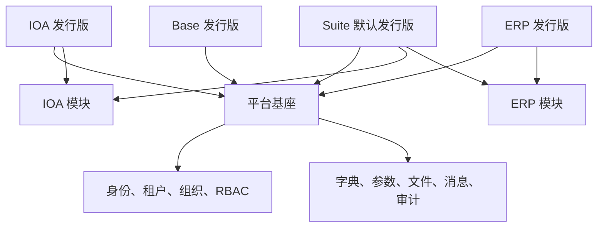
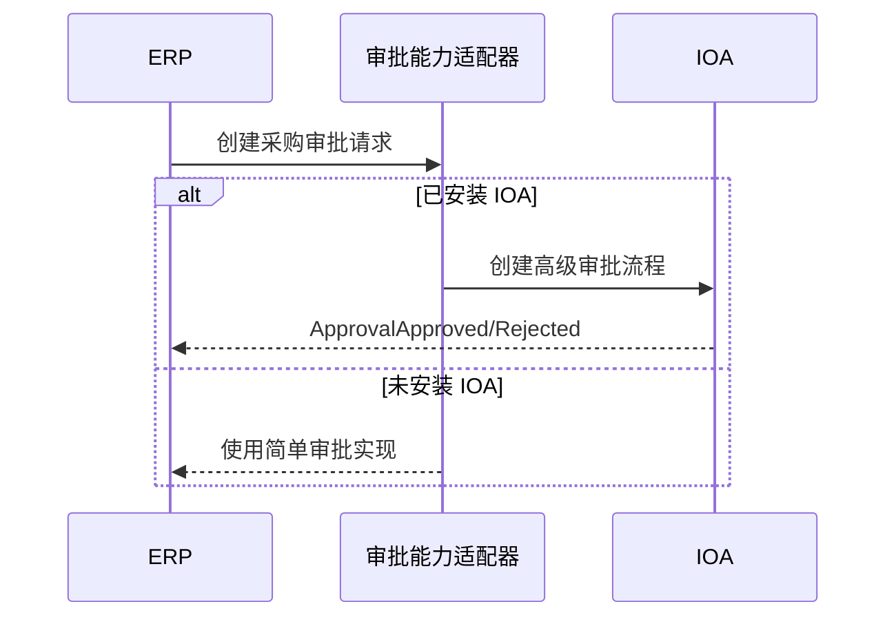

# 模块化产品架构规划

> 状态：规划中  
> 更新日期：2026-07-20
> 适用范围：Fast Vben Admin 基座及后续 IOA、ERP 等业务系统

关联架构决策见[架构决策记录索引](./adr/README.md)。本规划新增的 ADR-0003 至 ADR-0009 状态为 `Proposed`，通过 Items 模块验证后再转为 `Accepted`。

## 1. 背景

Fast Vben Admin 当前已经具备统一登录、多租户、组织、RBAC、动态菜单、文件、消息、审计和 OpenAPI 契约等平台能力。后续计划在此基础上增加 IOA、ERP 等业务系统，并支持以下部署形态：

- 仅部署平台基座。
- 部署平台基座和 IOA。
- 部署平台基座和 ERP。
- 默认部署平台基座、IOA、ERP 及其他已交付模块。
- 所有已启用模块默认在同一套登录、布局、导航和权限体系下展示。

这里的“独立部署”首先指按产品组合交付，而不是要求每个模块从第一天起就是独立微服务或微前端。

## 2. 架构目标

1. 基座与业务模块边界清晰，业务模块不能复制用户、租户、组织和权限能力。
2. 任意业务模块只依赖基座即可部署，避免 ERP 强依赖 IOA 或 IOA 强依赖 ERP。
3. 通过配置形成不同产品发行版，不通过复制仓库或长期维护多个分支实现。
4. 默认发行版在同一管理后台中展示所有已启用系统。
5. 模块具备独立的路由、模型、迁移、权限、菜单、前端页面、测试和版本信息。
6. 为将来拆分独立服务保留边界，但不提前承担微服务和微前端的复杂度。

## 3. 总体方案

采用“平台基座 + 业务模块 + 产品发行版”的三层结构。



推荐的发行版如下：

| 发行版 | 启用模块 | 用途 |
| --- | --- | --- |
| `base` | `platform` | 仅使用管理平台公共能力 |
| `ioa` | `platform, ioa` | 独立办公系统 |
| `erp` | `platform, erp` | 独立 ERP 系统 |
| `suite` | `platform, ioa, erp` | 默认一体化产品 |

近期采用模块化单体和构建期组合。只有出现独立团队、独立发布周期、独立扩容或强隔离要求时，才将特定模块演进为独立服务。

## 4. 模块边界

### 4.1 平台基座

平台基座负责所有系统共享的能力：

- 登录、会话、MFA、OIDC、OAuth2。
- 用户、租户、租户成员、部门、岗位。
- 角色、菜单、按钮权限、数据权限。
- 字典、参数、文件和存储渠道。
- 消息发送渠道、站内消息、审计日志。
- 统一工作台、模块注册、模块状态和模块授权。
- 健康检查、监控、错误响应和 OpenAPI 基础契约。

平台基座不实现采购、库存、审批流等具体业务。

### 4.2 IOA 模块

IOA 负责办公协同领域，例如：

- 流程定义和审批实例。
- 待办、已办和抄送。
- 考勤、会议、行政和办公申请。
- 与其他模块对接的通用审批能力。

### 4.3 ERP 模块

ERP 负责企业经营领域，例如：

- 客户、供应商、物料等业务主数据。
- 采购、销售、库存和结算。
- 财务或财务系统集成。
- 经营分析和业务报表。

### 4.4 模块依赖原则

- IOA、ERP 等业务模块必须可以只依赖 `platform` 运行。
- 业务模块之间默认禁止直接导入代码、直接查询对方数据表或建立数据库外键。
- 跨模块协作通过稳定接口、领域事件或能力适配器完成，公开面和依赖方向遵循 [ADR-0009](./adr/0009-module-public-contracts-and-dependency-boundaries.md)。
- 可选能力必须支持降级。例如 ERP 需要审批时，IOA 存在则使用高级流程；IOA 不存在时使用 ERP 简单审批或明确关闭该功能。
- 模块依赖必须形成有向无环图，禁止循环依赖。

## 5. 模块契约

每个模块必须提供统一的模块定义，至少声明：

```yaml
code: erp
name: ERP
version: 1.0.0
platform_version: ">=1.0,<2.0"
dependencies: []
schema_requirements:
  platform: "<minimum-platform-revision>"
optional_capabilities:
  - workflow.approval
api_prefix: /api/v1/erp
permission_prefix: erp
frontend_entry: modules/erp/module.ts
migration_namespace: erp
```

一个完整模块应包含：

- 后端模型、Schema、路由、服务和领域逻辑。
- 独立的数据库迁移和初始化数据。
- 权限码、菜单定义和默认角色授权建议。
- 前端 API、页面、组件、路由和国际化资源。
- 单元测试、接口测试和最小端到端测试。
- 版本、依赖、健康状态和兼容性声明。

模块注册器只装载当前发行版启用的模块。edition、构建 Manifest 和运行状态的唯一事实源遵循 [ADR-0003](./adr/0003-edition-module-source-of-truth.md)。概念接口如下：

```python
class ModuleDefinition:
    code: str
    version: str
    dependencies: tuple[str, ...]
    optional_capabilities: tuple[str, ...]
    routers: tuple[APIRouter, ...]
    permissions: tuple[PermissionSpec, ...]
    menus: tuple[MenuSpec, ...]
    migration: MigrationSpec
    lifecycle: LifecycleHooks
    provided_capabilities: tuple[CapabilityProvider, ...]
    event_subscribers: tuple[EventSubscriber, ...]
    workers: tuple[WorkerSpec, ...]
    schedules: tuple[ScheduleSpec, ...]
    reference_guard: ReferenceGuard | None

    def health(self) -> dict[str, object]: ...
```

这里展示的是目标契约的核心形态，不要求所有字段直接使用裸回调。权限、菜单、迁移、生命周期、Worker 和定时任务应使用结构化声明或类型明确的 Provider。具体实现保持显式注册，避免通过不受控的目录扫描导入任意 Python 模块。

## 6. 推荐目录结构

现有基座代码可以暂时保留原位，新业务先遵循模块结构，之后再逐步拆分集中式文件。

```text
backend/app/
  api/
  core/
  contracts/
    capabilities/
  modules/
    registry.py
    ioa/
      module.py
      public_api/
        queries.py
        commands.py
        dto.py
        events.py
      domain/
      application/
        ports.py
        services/
      infrastructure/
      routes/
      permissions.py
      menus.py
      migrations/
    erp/
      module.py
      public_api/
        queries.py
        commands.py
        dto.py
        events.py
      domain/
      application/
        ports.py
        services/
      infrastructure/
      routes/
      permissions.py
      menus.py
      migrations/

frontend/apps/web-antd/src/
  modules/
    registry.ts
    ioa/
      module.ts
      api/
      views/
      locales/
    erp/
      module.ts
      api/
      views/
      locales/

editions/
  base.yaml
  ioa.yaml
  erp.yaml
  suite.yaml
```

## 7. 模块启用与菜单权限

需要区分以下五个概念：

1. **已安装**：当前发行版或运行环境是否包含该模块。
2. **运行正常**：模块的期望状态为启用，观测状态为就绪。
3. **有权益**：当前租户套餐或平台级合同授权是否包含该模块。
4. **租户启用**：租户是否在已有权益内主动启用模块。
5. **已授权**：当前用户角色是否拥有模块内具体菜单和操作权限。

最终可见菜单为：

```text
已安装模块 ∩ 运行正常 ∩ 租户有效权益 ∩ 租户启用偏好 ∩ 角色已授权菜单
```

建议增加以下模型：

| 模型 | 作用 |
| --- | --- |
| `ModuleRegistry` | 记录模块版本、期望状态、观测状态和健康信息 |
| `TenantPlanModule` | 记录租户套餐包含的模块 |
| `TenantModuleEntitlementOverride` | 记录平台管理员授予或收回的合同权益覆盖 |
| `TenantModule` | 记录租户在有效权益内的启用偏好 |

现有 `TenantPlanMenu` 和 `RoleMenu` 继续负责细粒度菜单授权，但不单独承担模块安装、权益和启用状态。租户管理员不能通过 `TenantModule` 获得套餐或平台授权之外的模块权益。

菜单只负责前端展示，不能作为安全边界。所有业务模块后端接口必须使用 [ADR-0004](./adr/0004-module-access-control.md) 定义的模块访问依赖，同时校验构建安装、期望与观测状态、租户权益、租户启用偏好和权限码。超级管理员只能绕过 RBAC，不能绕过模块安装、运行状态和租户权益。权限码采用命名空间：

```text
platform:user:list
ioa:workflow:create
ioa:task:approve
erp:purchase-order:create
erp:inventory:adjust
```

## 8. 前端集成

前端继续使用一套 Vben 应用壳，保留统一登录、布局、标签页、通知和个人中心。

构建过程根据 edition 生成模块注册表：

```ts
export const enabledModules = [platformModule, ioaModule, erpModule];
```

每个前端模块注册：

- 页面组件映射。
- API 客户端。
- 国际化资源。
- 模块级初始化逻辑。
- 可选的工作台部件。

平台与各业务模块分别生成自己的 OpenAPI 客户端，具体目录、命名空间和 edition 组合规则遵循 [ADR-0008](./adr/0008-module-openapi-client-generation.md)。业务模块只能依赖自己的生成客户端和平台公开客户端。

后端动态菜单中的 `component` 必须指向已启用模块注册的组件。构建时应校验所有菜单组件均存在，防止菜单可见但页面未打包。

默认 `suite` 发行版在主导航中按业务域展示，例如：

```text
工作台
办公协同
  待办事项
  流程中心
ERP
  采购管理
  销售管理
  库存管理
系统管理
```

第一阶段不采用运行时微前端。仅当不同模块必须独立部署前端、无需重新构建主应用即可升级时，再评估 Module Federation 等方案。

## 9. API 与认证

新增模块的 API 使用独立路径命名空间：

```text
/api/v1/platform/*
/api/v1/ioa/*
/api/v1/erp/*
```

现有未分域接口可以保留兼容，不要求一次性迁移。

平台和模块分别维护 OpenAPI 子契约，当前 edition 仍提供组合后的 `/api/v1/openapi.json`。API 路径、operation ID 和公开 Schema 名称必须包含模块命名空间，避免组合契约冲突。

模块化单体阶段共享当前认证依赖和请求上下文，统一取得：

- `user_id`
- `tenant_id`
- 当前角色和权限码
- 部门和数据权限范围
- 请求追踪标识

未来拆分独立服务时，应由网关保持统一入口，并将认证升级为非对称签名令牌和 JWKS 公钥验证。业务服务不得共享基座签名私钥，也不得把共享数据库查询当作授权方式。

## 10. 数据与迁移

数据库迁移遵循 [ADR-0005](./adr/0005-module-migration-orchestration.md)。现有平台表暂时保留在 `public` Schema，新业务模块使用独立 PostgreSQL Schema、Alembic 环境和版本表：

```text
public.*
ioa.*
erp.*
```

基本原则：

- 模块只写入自己拥有的数据表。
- 业务表统一包含 `tenant_id`，并沿用当前租户隔离策略。
- 跨模块只保存稳定标识，例如 `user_id`、`department_id`，避免跨模块外键。
- 需要展示历史名称时保存必要快照，避免主数据变化破坏历史单据。
- 平台主数据标识不可复用；用户、部门、岗位和租户遵循 [ADR-0007](./adr/0007-platform-master-data-lifecycle.md) 的停用、归档、匿名化和物理删除协议。
- 跨模块一致性使用事件和补偿，不使用跨模块数据库事务。
- 模块迁移具备独立命名空间，避免多个团队产生 Alembic revision 冲突。

模块化单体阶段可以共用一个 PostgreSQL 实例。拆分服务后，每个服务拥有自己的数据库，不能直接访问其他服务的表。

## 11. 跨模块集成

同步查询使用模块公开接口，状态传播和业务联动优先使用领域事件。模块公开接口、可选能力和导入方向遵循 [ADR-0009](./adr/0009-module-public-contracts-and-dependency-boundaries.md)：

- 跨模块调用只传公开 DTO、稳定标识和明确的请求上下文，不传 ORM 实体或数据库 Session。
- 必选依赖只能导入提供方 `public_api`。
- 可选能力通过稳定能力契约和组合根绑定，消费者不能直接导入可选模块。
- 平台主数据通过 `platform.public_api` 中的窄接口读取，业务模块不能查询平台表；Router 所需认证和租户上下文通过稳定的 `platform.web_api` 取得。

示例：ERP 采购单需要审批。



模块生命周期和跨模块事件遵循 [ADR-0006](./adr/0006-module-lifecycle-and-events.md)。凡是会改变其他模块业务状态的事件都必须采用事务 Outbox；事件必须携带 `event_id`、`tenant_id`、`aggregate_id`、事件版本和发生时间，消费者必须支持幂等、重试和死信处理。

## 12. 构建与部署

通过 edition 配置控制前后端模块集合。edition YAML 是唯一人工维护的构建输入，并生成前后端共用的 `build-manifest.json`，例如：

```yaml
# editions/erp.yaml
name: erp
modules:
  - platform
  - erp
```

构建产物建议区分为：

```text
fast-vben-base:<version>
fast-vben-ioa:<version>
fast-vben-erp:<version>
fast-vben-suite:<version>
```

可通过 Docker Build Argument 或构建脚本传入 `APP_EDITION`。生产部署不能只在前端隐藏未启用模块，后端也必须只注册当前 edition 的业务路由和初始化任务。

默认发行版为 `suite`。部署差异仅来自 edition 和环境配置，不创建长期产品分支。

## 13. 版本与发布

- 基座维护平台契约版本，例如 `platform_api_version=1`。
- 模块声明兼容的平台版本范围。
- 模块自身使用语义化版本。
- 删除 API、权限码、事件字段时必须提供迁移周期。
- 发行版锁定基座和模块版本，保证可以重现部署。
- CI 必须覆盖 `base`、`ioa`、`erp`、`suite` 四种组合。

每种组合至少验证：

- 后端可启动且只注册预期路由。
- 数据库迁移可以从空库完成。
- 菜单组件全部存在。
- OpenAPI 可以生成前端客户端。
- 平台及每个已启用模块的 OpenAPI 客户端可以独立生成，组合契约不存在命名冲突。
- 前端类型检查和生产构建通过。
- 登录、租户切换、菜单加载和权限拒绝流程正常。

## 14. 实施阶段

### 阶段一：建立模块基础设施

- 按 ADR-0003 实现 Build Manifest、ModuleDefinition 和模块注册器。
- 增加 `APP_EDITION` 配置，生产环境不允许通过 `ENABLED_MODULES` 任意改写产品组合。
- 按 ADR-0004 实现模块、租户和 RBAC 的统一访问依赖。
- 按 ADR-0005 实现模块迁移编排器和迁移状态记录。
- 按 ADR-0006 实现模块生命周期、Outbox、投递 Worker 和幂等消费基础设施。
- 按 ADR-0007 实现平台主数据归档、生命周期事件和跨模块引用检查契约。
- 按 ADR-0008 拆分平台及模块 OpenAPI 客户端生成流程。
- 按 ADR-0009 建立 `public_api`、能力 Provider、组合根和自动导入边界检查。

### 阶段二：验证模块契约

- 将现有 Items 示例改造成标准业务模块。
- 验证模块路由、菜单、权限、迁移、前端页面和测试的完整注册过程。
- 建立四种发行版的 CI 构建矩阵。

### 阶段三：建设 IOA

- 优先定义审批能力接口和领域事件。
- 完成 IOA 独立发行版及 Suite 集成。
- 验证 IOA 缺失时其他模块可以正常运行。

### 阶段四：建设 ERP

- 按采购、销售、库存等领域继续划分 ERP 内部子模块。
- 通过审批能力适配器与 IOA 可选集成。
- 完成 ERP 独立发行版及 Suite 集成。

### 阶段五：按需服务化

只有满足下列一个或多个条件时才拆分服务：

- 模块由独立团队以不同周期发布。
- 模块需要独立扩容或资源隔离。
- 模块有明确的安全、合规或故障隔离要求。
- 模块边界和接口已经稳定，拆分收益高于运维成本。

## 15. 完成标准

模块化架构第一阶段完成时，应满足：

- 不修改核心路由文件即可注册一个新业务模块。
- 不修改集中式菜单种子函数即可注册模块菜单和权限。
- 业务模块只能导入平台及已声明依赖的公开接口，违规导入由 CI 阻止。
- 可选模块缺失时消费者仍可启动，并执行声明的降级或功能关闭策略。
- 可以从同一代码库构建四种发行版。
- `base` 产物不暴露 IOA、ERP 接口或菜单。
- `ioa`、`erp` 均能在没有对方的情况下正常运行。
- `suite` 在同一后台中展示所有已授权模块。
- 禁用模块后，前端页面、后端路由、初始化任务和定时任务同时失效。
- 模块升级失败不会造成其他模块迁移状态不明确。
- 租户管理员不能通过启用偏好突破套餐或平台授予的模块权益。
- 归档平台用户、部门或岗位后，历史业务引用仍可解释且不会变成孤儿数据。
- Base 与 Suite 生成 API 客户端时不会互相覆盖模块产物。

## 16. 当前项目的改造重点

当前项目已经具备后端动态菜单和权限机制，适合继续作为统一应用壳。需要重点解除以下集中式耦合：

- `backend/app/api/main.py` 当前静态导入并注册全部路由，应改由模块注册器装配业务路由。
- `backend/app/core/db.py` 当前集中维护菜单种子，应允许模块独立提供菜单和权限。
- `backend/app/models.py` 当前集中维护模型，新业务模型应进入各自模块。
- 当前业务 Router 直接依赖 `app.models`、`app.api.deps` 等平台内部实现，应按 ADR-0009 逐步改为模块自有模型和平台公开端口。
- 当前缺少自动导入边界检查，应在 Items 验证阶段增加 AST 或 import-linter 规则。
- `frontend/apps/web-antd/src/router/access.ts` 当前扫描统一 `views` 目录，应扩展为 edition 生成的模块组件映射。
- `scripts/generate-openapi.mjs` 当前只生成一份全局客户端，应按 ADR-0008 拆分平台、模块和组合契约。
- 当前用户删除流程可能物理删除全局用户，引入业务模块前应按 ADR-0007 改为归档或受控匿名化。
- 现有 Alembic 迁移链需要增加模块命名和并行开发约束。

改造应采用渐进方式：保持现有基座行为兼容，先让新模块遵守新契约，再逐步迁移现有业务示例，避免一次性重构全部平台代码。

## 17. 不在当前阶段实施的内容

- 不立即引入服务注册中心、分布式事务和服务网格。
- 不立即将 IOA、ERP 做成运行时微前端。
- 不为每个发行版复制一份代码或建立长期分支。
- 不允许通过只隐藏菜单的方式实现模块禁用。
- 不允许业务模块直接依赖其他业务模块的内部实现或数据表。

该方案优先解决模块组合、边界治理和交付一致性，并为后续服务化保留演进路径。
